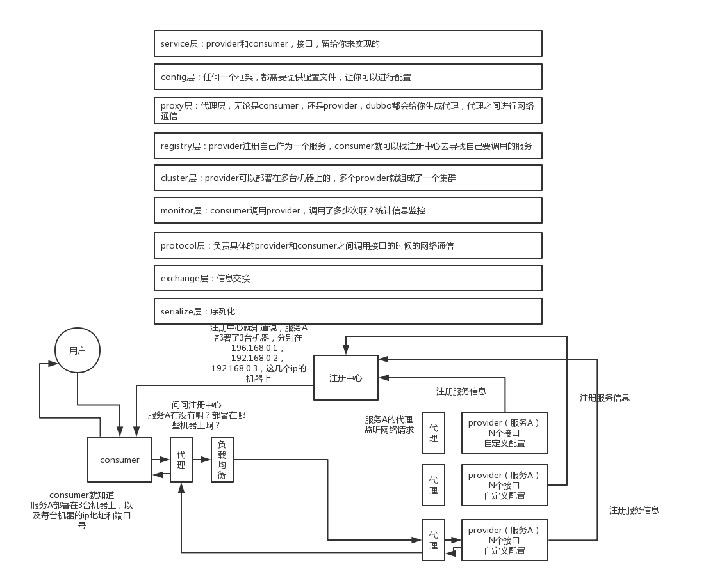

# RPC 和微服务总结

## 自己设计一个 RPC 服务的时候需要考虑的内容

1. 注册中心，保存服务的信息，例如 zookeeper
2. 消费者去服务的注册中心拿对应的服务信息
3. 如何发送请求？基于接口+动态代理的模式，通过动态代理里的程序去找对应的服务
4. 服务提供端的负载均衡算法
5. 发送请求的时候的数据的传输的序列化方式，请求方式，例如使用 netty ，nio方式，使用 hessian 序列化协议之类的
6. 服务端也要监听某个网络端口，将接收到的请求指定到对应的服务上去

## Dubbo

### Dubbo 整体架构

1. service 层，接口层，给服务提供者和消费者来实现
2. config 配置层：对外配置接口，以 ServiceConfig, ReferenceConfig 为中心，可以直接初始 化配置类，也可以通过 spring 解析配置生成配置类，主要是对 dubbo 进行各种配置的
3. proxy 服务代理层：服务接口透明代理，生成服务的客户端 Stub 和服务器端 Skeleton, 以 ServiceProxy 为中心，扩展接口为 ProxyFactory，无论是 consumer 还是 provider，dubbo 都会给你生成代理，代理之间进行网络通信
4. registry 层：服务注册层，负责服务的注册与发现，扩展接口为 RegistryFactory, Registry, RegistryService
5. cluster 层，集群层，封装多个服务提供者的路由以及负载均衡，将多个实例组合成一个服务，扩展接口为 Cluster, Directory, Router, LoadBalance
6. monitor 层，监控层，对 rpc 接口的调用次数和调用时间进行监控，扩展接口为 MonitorFactory, Monitor, MonitorService
7. protocal 层，远程调用层，封装 rpc 调用，扩展接口为 Protocol, Invoker, Exporter
8. exchange 层，信息交换层，封装请求响应模式，同步转异步，以 Request, Response 为中心， 扩展接口为 Exchanger, ExchangeChannel, ExchangeClient, ExchangeServer
9. transport 层，网络传输层，抽象 mina 和 netty 为统一接口，以 Message 为中心，扩展接口为 Channel, Transporter, Client, Server, Codec
10. serialize 层，数据序列化层，可复用的一些工具，扩展接口为 Serialization, ObjectInput, ObjectOutput, ThreadPool

### 工作流程

## 微服务

### 拆分微服务的好处

1. 功能剥离，实现数据之间解耦
2. 可以实现快速迭代
3. 可以进行灰度发布
4. 提高质量线

### Spring Cloud

1. 服务注册与发现：eureka、consul
2. 网关：Zuul/Zuul2/Spring Cloud Gateway
3. 负载均衡：通过 Feign和Ribbon 实现
4. 服务熔断：Hytrix、Alibaba Sentinel