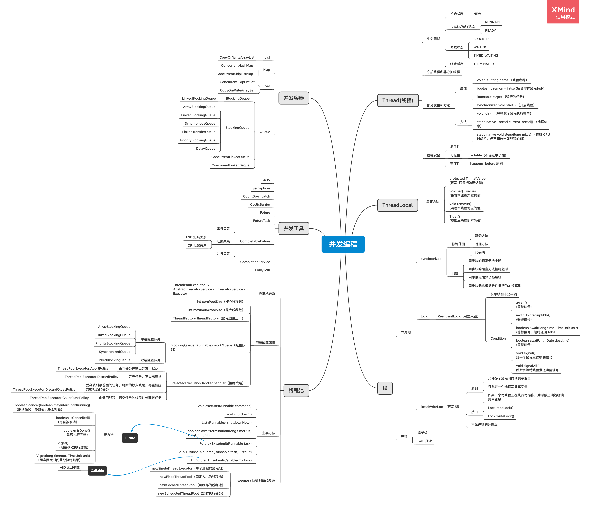

# 并发编程总结

## 脑图



## Thread

### 守护线程

​	守护线程是指为其他线程服务的线程。在JVM中，所有非守护线程都执行完毕后，无论有没有守护线程，虚拟机都会自动退出。

​	通过 Thread#setDaemon(true) 方式启动。

### start() 和 run() 方法的区别

​	start() 方法创建新线程，run() 方法是本线程调用。

### 部分属性和方法

| 部分属性/方法                         | 说明                                                         |
| ------------------------------------- | ------------------------------------------------------------ |
| volatile String name;                 | 线程名称 - 诊断分析使用                                      |
| boolean daemon = false;               | 后台守护线程标识 - 决定 jvm 优雅关闭，默认不开启守护线程     |
| Runnable target;                      | 当前要运行的任务（只能通过构造函数传入）                     |
| synchronized void start()             | 【协作】启动新线程并自动执行                                 |
| void join()                           | 【协作】等待某个线程执行完毕                                 |
| static native Thread currentThread()  | 静态方法：获取当前线程信息                                   |
| static native void sleep(long millis) | 静态方法：线程睡眠并让出 CPU 时间片，但是 sleep 方法不释放当前线程的锁，并且不能被唤醒 |

### wait & notify

| Object#方法                        | 说明                                                         |
| ---------------------------------- | ------------------------------------------------------------ |
| void wait()                        | 释放当前锁之后，等待 0 ms ，再尝试获取锁                     |
| void wait(long timeout, int nanos) | 释放当前锁，等待到了时间自动唤醒或者中途被 notify() 或 notifyAll() 唤醒，nanos > 0 了话会将 timeout 参数 ++ |
| native void wait(long timeout)     | 释放当前锁，等待到了时间自动唤醒或者中途被 notify() 或 notifyAll() 唤醒，唤醒之后需要自动获取锁 |
| native void notify()               | 发送信号通知 1 个等待线程                                    |
| native void notifyAll()            | 通知所有 wait 的线程                                         |

### Thread 的状态改变操作

#### 等待但不释放锁

1. Thread.sleep(long millis)

   ​	静态方法。调用的时候是针对当前调用的线程，此时线程进入 TIMED_WAITING 状态，让出 CPU 时间片，但**不释放对象锁**， millis 时间后，线程自动苏醒进入就绪状态。

2. Thread.yield()

   ​	静态方法。调用的时候是针对当前调用的线程，该方法放弃获取的 CPU 时间片，但**不释放锁资源**，由运行状态变为就绪状态，让 OS 再次选择线程。

3. Thread#join() / Thread#join(long millis)

   ​	对象方法。当前线程中调用其他线程 t 的 join 方法，当前线程进入 WAITING/TIMED_WAITING 状态，**当前线程不会释放已经持有的锁资源**，待 t 线程执行完成或者 millis 时间到，当前线程进入就绪状态。

#### 等待但会释放锁

1. Object#wait()

   ​	对象方法。当前线程调用对象的 wait 方法后，**当前线程释放锁资源**，进入等待队列。依靠 notify() / notifyAll() 唤醒或者 wait(long timeout) 的 timeout 时间到了之后自动唤醒。

#### 唤醒方法

1. Object#notify()/ Object#notifyAll()

   ​	对象方法。唤醒在此对象监视器上等待的线程，notify 唤醒随机一个，notifyAll 唤醒所有等待线程，让其去争夺 CPU 资源。

### Thread 的中断与异常处理

1. 线程内部自己处理异常，不会溢出到外层。
2. 如果线程被 Object#wait、Thread#join 和 Thread#sleep 三种方法之一的任何一个方法调用导致阻塞，此时调用该线程的 interrupt() 方法，那么该线程会抛出一个 InterruptedException 中断异常（该线程必须事先预备好处理此异常），从而提早地终结被阻塞状态。如果线程当前没有被阻塞，这时调用 interrupt() 方法将不起作用，直到执行了 wait、sleep、join 的一种时，立马抛出 InterruptedException。相当于 interrupt() 方法给当前线程设置了一个标识，记录当前线程是 Interrupt 状态。
3. 如果是计算密集型的操作了话，分段处理，每个片检查一下状态，是否需要终止。

### Thread 的生命周期

#### 1. RUNNABLE 与 BLOCKED 的状态装换

​		只有一种情况能够触发这种转换，就是线程等待 synchronized 的隐式锁，synchronized 修饰的方法或代码块同一时刻只允许一个线程执行，其他线程就会从 RUNNABLE 转到 BLOCKED 状态，当等待的线程获取到 synchronized 隐式锁时，就又会从 BLOCKED 状态变为 RUNNABLE 状态。

#### 2. RUNNABLE 与 WAITING 的状态转换

三种场景

1. 获得 synchronized 隐式锁的线程，调用Object#wait() 会进入等待状态，可通过 Object#notify() 或 notifyAll() 方法唤醒。
2. Thread#join()，join() 对应的那个线程结束之后，当前调用的线程自动唤醒。
3. LockSupport#park()，通过 LockSupport#unpark(Thread thread) 方法唤醒。

#### 3. RUNNABLE 与 TIMED_WAITING 的状态转换

1. Thread.sleep(long millis)
2. 获得 synchronized 隐式锁的线程调用 Object#wait(long timeout) 方法
3. Thread.join(long millis)
4. LockSupport.parkNanos(Object blocker, long deadline)
5. LockSupport.parkUntil(long deadline)

## 线程安全

### 原子性

​		一个或多个操作在 CPU 执行过程中不会被中断的特性称为原子性

### 可见性

​		由于 CPU 的缓存会导致可见性问题。可以通过 **volatile 关键字来保证可见性**，它会保证修改的值会立即被更新到主存，当有其他线程需要读取时，它会去内存中读取新值，**但是 volatile 不能保证原子性**；另外，还可以通过 synchronized 和 Lock 也能保证可见性，保证同一时刻只有一个线程获取锁，并且在释放锁之前将会对变量的修改刷新到主存当中。

### 有序性

​		java 编译器和处理器对指令进行的重排序可能会产生有序性问题。

#### happens-before 原则：

​		前面一个操作的结果对后续操作是可见的。

1. 程序次序规则

   一个线程内，按照代码先后顺序

2. 锁定规则

   一个 unLock 操作先行发生于对同一个锁的 lock 操作

3. volatitle 变量规则

   对一个变量的写操作先行发生于后面对这个变量的读操作

4. 传递规则

   如果操作 A 先行发生于操作 B，操作 B 先行发生于操作 C，则操作 A 先行发生于操作 C

5. 线程启动规则

   Thread 对象的 start() 方法先行发生于此线程的每一个动作

6. 线程中断规则

   对线程 interrupt() 方法的调用先行发生于被中断线程的代码检测到中断事件的发生

7. 线程终结规则

   线程中所有的操作都先行发生于线程的终止检测

8. 对象终结规则

   一个对象的初始化完成先行发生于它的 finalize() 方法的开始

### volatile

1. 每次读取都强制从主内存刷数据
2. 适用场景：单个线程写；多个线程读
3. 原则：能不用就不用，不确定的时候也不用，因为 volatile 不能保证原子性
4. 替代方案：Atomic 原子操作类
5. volatile 能够防止指令重排序，volatile 上面的赋值对底其底下的操作可见

### final

| final 定义类型    | 说明                                                         |
| ----------------- | ------------------------------------------------------------ |
| final class XXX   | 不允许继承                                                   |
| final 方法        | 不允许 Override                                              |
| final 局部变量    | 不允许修改                                                   |
| final 实例属性    | 1. 构造函数/初始化块/<init>之后不允许变更 2. 只能赋值一次 3.安全发布：构造函数结束返回时，final 预最新的值被保证对其他线程可见 |
| final static 属性 | 静态块执行后不允许变更；只能赋值一次                         |

final 申明的好处是告诉 jvm 和编译器我申明的这个是线程安全的。

## ThreadPoolExecutor

### 构造函数

有 3 个，目前这里放了最多参数的那个，比较全面

```java
public ThreadPoolExecutor(int corePoolSize,
                          int maximumPoolSize,
                          long keepAliveTime,
                          TimeUnit unit,
                          BlockingQueue<Runnable> workQueue,
                          RejectedExecutionHandler handler) {
    this(corePoolSize, maximumPoolSize, keepAliveTime, unit, workQueue,
         Executors.defaultThreadFactory(), handler);
}
```

### 类关系

ThreadPoolExecutor 继承 abstract class AbstractExecutorService，AbstractExecutorService 实现 interface ExecutorService，EexcutorService 继承 interface Executor

### 相关属性

| 重要属性                          | 说明           |
| --------------------------------- | -------------- |
| int corePoolSize                  | 核心线程数     |
| int maximumPoolSize               | 最大线程数     |
| ThreadFactory threadFactory       | 线程创建工厂   |
| BlockingQueue<Runnable> workQueue | 工作队列       |
| RejectedExecutionHandler handler  | 拒绝策略处理器 |

### 相关方法

| 重要方法                                               | 说明                                                         |
| ------------------------------------------------------ | ------------------------------------------------------------ |
| void execute(Runnable command);                        | 执行可运行的任务                                             |
| void shutdown();                                       | 关闭线程池                                                   |
| List<Runnable> shutdownNow();                          | 立即关闭                                                     |
| boolean awaitTermination(long timeOut, TimeUnit unit); | 阻塞等待一段时间查看是否结束                                 |
| Future<?> submit(Runnable task)                        | 提交任务，由于 Runnable 没有返回结果，所以这里的 Futrue 可以用来断言任务已经结束了，类似 Thread.join() |
| <T> Future<T> submit(Runnable task, T result)          | 提交任务，可以通过 Future 获取到 submit 时候的 result 作为返回值 |
| <T> Future<T> submit(Callable<T> task)                 | 提交任务，允许控制任务和获取 Callable 的返回结果             |

### 任务提交逻辑

execute(Runnable command) 方法：

1. 获取当前正在执行的线程数
2. 判断当前线程数是否小于设置的核心线程数，如果小于，就创建一个新的线程。
3. 如果大于等于设置的核心线程数，就进入判断当前所有线程是否正处于运行状态并往阻塞队列中插入当前的 command 是否返回 ture，如果满足，就继续后续的一些判断。
4. 如果 workQueue 都满了，就再一次尝试增加新的线程，此时判断的是最大线程数，如果当前已经达到了最大线程数，则执行拒绝策略处理器。

### 线程池参数

#### 缓冲队列（BlockingQueue）

​		BlockingQueue 是双缓冲队列。BlockingQueue 内部使用两条队列，允许两个线程同时向队列一个存储，一个取出操作。在保证并发安全的同事，提高了队列的存取效率。BlockingQueue 阻塞是发生在当队列已满时，入队操作阻塞；当队列已空时，出队操作阻塞。

​		单端与双端：单端指的是只能队尾入队，队首出队；双端指的是队首队尾都可以入队和出队。单端以 Queue 结尾，双端以 Deque 结尾。

##### 单端阻塞队列

1. ArrayBlockingQueue：规定大小的 BlockingQueue，构造时必须制定大小，所含对象是 FIFO（first in first out）顺序排序的。
2. LinkedBlockingQueue：大小不固定的 BlockingQueue，若其构造时制定大小，生成的 BlockingQueue 有大小限制，不指定大小了话其大小由 Integer.MAX_vALUE 来决定，所含对象是 FIFO 顺序排序的。
3. PriorityBlockingQueue：类似于 LinkedBlockingQueue，但是对象的排序不是按照 FIFO，默认是对象的自然顺序或者构造函数的 Comparator 决定。
4. SynchronizedQueue：特殊的 BlockingQueue，此时生产者线程的入队操作必须等待消费者线程的出队操作。

##### 双端阻塞队列

1. LinkedBlockingDeque

#### 拒绝策略（RejectedExecutionHandler）

1. ThreadPoolExecutor.AbortPolicy：丢弃任务并抛出 RejectedExecutionException 异常，java 默认使用该策略。
2. ThreadPoolExecutor.DiscardPolicy：丢弃任务，但是不抛出异常。
3. ThreadPoolExecutor.DiscardOldesPolicy：丢弃队列最前面的任务，将新的放入队尾，然后重新提交被拒绝的任务。
4. ThreadPoolExecutor.CallerRunsPolicy：由调用线程（提交任务的线程）处理该任务。

### Executors 创建线程池方法

1. newSingleThreadExecutor

   ​	创建一个单线程的线程池。这个线程池只有一个线程在工作，也就是相当于单线程串行执行所有任务。如果这个唯一的线程因为异常结束，那么会有一个新的线程来替代它。此线程池保证所有任务的执行顺序按照任务的提交顺序执行。

2. newFixedThreadPool

   ​	创建固定大小的线程池。每次提交一个任务就创建一个线程，直到线程达到线程池的最大大小。线程池的大小一旦达到最大值就会保持不变，如果某个线程因为执行异常而结束，那么线程池会补充一个新线程。该方法直接创建的线程池中阻塞队列使用的是 LinkedBlockingQueue，可以放无限多的 runnable。

3. newCachedThreadPool

   ​	创建一个可缓存的线程池。如果线程池的大小超过了处理任务所需要的线程，那么就会回收部分空闲线程（60秒不执行任务），当任务数量增加时，又会增加新的线程。该方法创建的线程池不会限制线程的创建数量，完全依赖于操作系统（或者说 JVM）能够创建的最大线程大小。

4. newScheduledThreadPool

   ​	创建一个大小无限的线程池。此线程池支持定时周期性的执行任务的需求。

### 创建固定线程的经验

java 工具创建的线程池核心数和最大核心数是一样的

假设核心数为 N

1. 如果是 CPU 密集型应用（有很多计算的），则线程池大小设置为 N 或 N+1
2. 如果是 IO 密集型应用，则线程池大小设置为 2N 或者 2N+2

## Callable 和 Future

### Callable 基础接口

V call() throws Exception 有返回值

### Future

| 重要方法                                                     | 说明                             |
| ------------------------------------------------------------ | -------------------------------- |
| boolean cancel(boolean mayInterruptIfRunning)                | 取消任务，传入的参数决定是否打断 |
| boolean isCancelled()                                        | 是否被取消                       |
| boolean isDone()                                             | 是否执行完毕                     |
| V get() throws InterruptedException, ExecutionException      | 阻塞获取执行结果                 |
| V get(long timeout, TimeUnit unit) throws InterruptedException,ExecutionException,TimeoutException | 阻塞固定时间获取执行结果         |

## Lock

### 为什么要显示的 Lock

#### synchronized 方式的问题

1. 同步块的阻塞无法中断（不能 interruptibly）
2. 同步块的阻塞无法控制超时（无法自动解锁）
3. 同步块无法异步处理锁（即不能立即知道是否可以拿到锁，在获取锁失败的时候，一定要进入阻塞状态）
4. 同步块无法根据条件灵活的加锁解锁（即只能跟同步块范围一致）

#### Lock 弥补了 synchronized 的问题

具体体现在以下几个方法:

```java
// 1.支持中断的 API
void lockInterruptibly() throws InterruptedException;
// 2.支持超时的 API
void tryLock(long time, TimeUnit unit) throws InterruptedException;
// 3.支持非阻塞获取锁的API
void tryLock();
```

### 可重入锁（ReentrantLock）

​	已经获取了锁的线程可以重复获取同一把锁

#### 公平锁和非公平锁

​	在创建 ReentrantLock 的时候，可以发现有两个构造函数，一个是无参构造器，一个是传入一个 fair 参数的构造函数。fair 为 true 是公平锁，fair 为 false 是非公平锁。公平锁唤醒的策略是谁等待的时间长，谁先唤醒；非公平锁则不提供这个公平保证，有可能等待时间短的线程先被唤醒。

#### Condition

通过 Lock.newCondition() 创建

##### 基础接口

| 重要方法                                                     | 说明                                                 |
| ------------------------------------------------------------ | ---------------------------------------------------- |
| void await() throws InterruptedException;                    | 等待信号；类比Object#wait()                          |
| void awaitUninterruptibly();                                 | 等待信号                                             |
| boolean await(long time, TimeUnit unit) throws InterruptedException; | 等待信号；超时则返回 false                           |
| boolean awaitUntil(Date deadline) throws InterruptedException; | 等待信号；超时则返回 false                           |
| void signal();                                               | 给一个等待线程发送唤醒信号；类比 Object#notify()     |
| void signalAll();                                            | 给所有等待线程发送唤醒信号； 类比 Object#notifyAll() |

### 读写锁（ReadWriteLock 悲观锁）

​	适用于读多写少的环境

#### 读写锁遵循的原则

1. 允许多个线程同时读共享变量。
2. 只允许一个线程写共享变量。
3. 如果一个写线程正在执行写操作，此时禁止读线程读共享变量。

#### 读写锁接口

| 重要方法         | 说明             |
| ---------------- | ---------------- |
| Lock readLock()  | 获取读锁；共享锁 |
| Lock writeLock() | 获取写锁；独占锁 |

#### 锁的升降级

​	读写锁 ReadWriteLock **不允许锁的升级**，既在获取到读锁的时候，无法在不 unLock 读锁的情况下再获取写锁，此时因为读锁没有释放，写锁会无限的等待。但是 ReadWriteLock **允许锁的降级**，也就是在获取到写锁的时候，可以在没有 unLock 写锁的情况下，获取到读锁。

## 并发原子类

### 无锁技术 - Atomic 工具类

#### 核心实现原理

1. 内部通过 volatile 保证读写操作都可见;
2. 使用 CAS 指令，作为**乐观锁**实现，通过自旋重试保证写入，就是如果在写的时候发现数据不对了，就重新去获取，然后处理完之后再去写入，不断的自旋进行尝试。

#### 无锁与锁的使用情况

1. 并发压力非常小的时候，性能本身要就不高，没有大的区别。
2. 并发压力一般的情况下，无锁更快，大部分都一次写入。
3. 并发压力非常大的时候，自旋导致重试过多，资源消耗很大。

#### LongAddr 对 AtomicLong 的改进

分段思想

1. AtomicInteger 和 AtomicLong 里的 value 是所有线程竞争读写的热点数据，在并发压力大的时候资源消耗大
2. 将单个 value 拆分成跟线程一样多的数组 Cell[]
3. 每个线程写自己的 Cell[i]++ ，最后对数组求和

## 并发工具类

​	用于解决更复杂的场景下的线程之间的相互协作，例如：控制实际并发访问资源的并发数量、需要多个线程在某个时间同时开始运行、指定数量线程到达某个状态再继续处理。

### AQS（AbstractQueuedSynchronizer）

​	抽象队列式的同步器，是构建锁或者其他同步组件的基础（如 Semaphore、CountDownLatch、ReentrantLock、ReentrantReadWriteLock）。

### Semaphore 信号量

​	通过一个计数器来控制并发线程数，当有线程访问时，通过调用 acquire 方法对计数器减一个指定值 ，当计数器小于等于0时，线程就会进入等待队列中；调用 releas 方法可对计数器加指定值，如果此时计数器 count 小于等于0，则会唤醒等待队列中的一个线程，并将其从等待队列中移除。

### CountDownLatch

​	适用场景：Master 线程等待 worker 线程把任务执行完之后再继续运行

​	CountDownLatch 通过调用 await() 方法，主要是在调用 await() 的方法的线程中进行等待。

| 重要方法                                   | 说明                     |
| ------------------------------------------ | ------------------------ |
| public CountDownLatch(int count)           | 构造方法，传入计数的总数 |
| void await() throws InterruptedException   | 等待数量归0              |
| boolean await(long timeout, TimeUnit unit) | 限时等待                 |
| void countDown()                           | 总数减1                  |
| long getCount()                            | 返回剩余数量             |

### CyclicBarrier

| 重要方法                                                  | 说明                                                       |
| --------------------------------------------------------- | ---------------------------------------------------------- |
| public CyclicBarrier(int parties)                         | 构造方法，传入需要等待的数量                               |
| public CyclicBarrier(int parties, Runnable barrierAction) | 构造方法，传入需要等待的数量以及等待完成之后需要执行的任务 |
| int await()                                               | 任务内部使用；等待大家都到齐                               |
| int await(long time, TimeUnit unit)                       | 任务内部使用；限时等待到齐                                 |
| void reset()                                              | 重新一轮                                                   |

与 CountDownLatch 不同的是，CountDownLatch 是在总数上不断减 1 ，最后归为 0 ，CyclicBarrier 是从 0 开始，调用 await() 后不断加 1，加到总数，并且 CyclicBarrier 加到总数之后会自己重置，可以重复利用，CyclicBarrier 是在最后一个执行了 await() 方法的那个线程上执行需要执行的任务。

### Future/FutureTask/CompletableFuture

三者都可以获取线程执行的返回结果

#### Future

​	Future 接口有 5 个方法，取消任务的方法 cancel()、判断任务是否已取消的方法 isCancelled()、判断任务是否已结束的方法 isDone()以及2 个获得任务执行结果的 get() 和 get(timeout, unit)，两个 get 方法都是阻塞式的，如果没有执行完都会阻塞。

​	可通过 ThreadPoolExecutor 的方法获取 Future

```java
// 提交Runnable任务
Future submit(Runnable task);
// 提交Callable任务 
Future submit(Callable task);
// 提交Runnable任务及结果引用 
Future submit(Runnable task, T result);
```

#### FutureTask

​	FutureTask 接口继承了 RunnableFuture，而 RunnableFuture 继承了 Runnable 和 Future ，由于 FutureTask 实现了 Runnable 所以可以通过 ThreadPoolExecutor 或者 Thread 执行，由于实现了 Future ，所以可以通过 get 方法获取线程执行后的结果。

#### CompletableFuture

​	异步执行，默认使用公共的 ForkJoinPool 线程池，这个线程池默认创建的线程数是 CPU 的核数（也可以通过 JVM option:-Djava.util.concurrent.ForkJoinPool.common.parallelism 来设置 ForkJoinPool 线程池的线程数），也可以使用自己自定义的线程池。

```java
//使用默认线程池
static CompletableFuture<Void> 
  runAsync(Runnable runnable)
static <U> CompletableFuture<U> 
  supplyAsync(Supplier<U> supplier)
//可以指定线程池  
static CompletableFuture<Void> 
  runAsync(Runnable runnable, Executor executor)
static <U> CompletableFuture<U> 
  supplyAsync(Supplier<U> supplier, Executor executor)  
```

​	CompletableFuture 的任务有时序关系，比如有串行关系、并行关系、汇聚关系等。

##### 串行关系

表示每一步依赖与上一步完成之后才继续执行。

该关系相关的方法是

```java
CompletionStage<R> thenApply(fn);
CompletionStage<R> thenApplyAsync(fn);
CompletionStage<Void> thenAccept(consumer);
CompletionStage<Void> thenAcceptAsync(consumer);
CompletionStage<Void> thenRun(action);
CompletionStage<Void> thenRunAsync(action);
CompletionStage<R> thenCompose(fn);
CompletionStage<R> thenComposeAsync(fn);
```

##### 汇聚关系

###### AND 汇聚关系

表示某两个线程都完成之后再继续下一步

该关系相关的方法

```java
CompletionStage<R> thenCombine(other, fn);
CompletionStage<R> thenCombineAsync(other, fn);
CompletionStage<Void> thenAcceptBoth(other, consumer);
CompletionStage<Void> thenAcceptBothAsync(other, consumer);
CompletionStage<Void> runAfterBoth(other, action);
CompletionStage<Void> runAfterBothAsync(other, action);
```

###### OR 汇聚关系

表示某两个线程只要完成一个就可以进行下一步

```java
CompletionStage applyToEither(other, fn);
CompletionStage applyToEitherAsync(other, fn);
CompletionStage acceptEither(other, consumer);
CompletionStage acceptEitherAsync(other, consumer);
CompletionStage runAfterEither(other, action);
CompletionStage runAfterEitherAsync(other, action);
```

#### 异常处理

```java
// 类似于 try{}cahtch{}
CompletionStage exceptionally(fn);
// 类似于 try{}finally{} 一定会执行，但是没有返回结果
CompletionStage<R> whenComplete(consumer);
CompletionStage<R> whenCompleteAsync(consumer);
// 类似于 try{}finally{} 一定会执行，有返回结果
CompletionStage<R> handle(fn);
CompletionStage<R> handleAsync(fn);
```

## 并发容器

### 简单实现 List 线程安全

1. ArrayList 方法上都加上 synchronized，即 Vector 类
2. Collections.synchronizedList，强制将 list 的操作加上同步
3. Arrays.asList，不允许添加删除，但是可以 set 替换元素
4. Collections.unmodifiableList，不允许修改内容，包括添加、删除和 set

### CopyOnWriteArrayList

​	CopyOnWriteArrayList ，顾名思义，在写的时候会复制一个 List，而进行**读操作是无锁的**。其内部为了一个数组，成员变量 array 指向内部这个数组，所有的读操作都是基于 array 来进行的，**迭代器 Iterator 遍历的也是对当前 array 数组做了一个快照**，此后的 List 元素变动，就跟这次迭代没有关系了。

​	在添加元素时，会复制一个原来的数组，长度比原来的数组大 1，然后在新的数组中将新元素添加进去，之后将原容器引用替换为新的副本。

​	在删除元素时，同样会复制一个删除掉指定索引的原来的数组，如果是删除的索引在中间部分，会复制删除索引的前一段和后一段，然后再将原容器引用替换为新的副本。

​	应用场景：适用于读多写少，并且能够容忍短暂的数据不一致性的场景。

#### ConcurrentHashMap

Jdk 7 时，采用的是分段锁的方式。

Jdk8，摒弃了分段锁的方案，直接使用一个大的数组，内部使用类似 CAS 的方式。