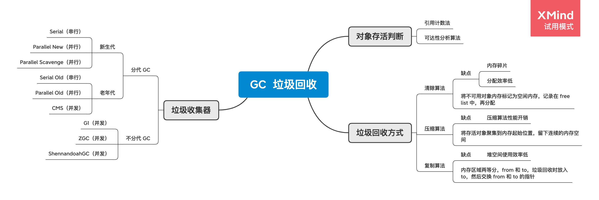
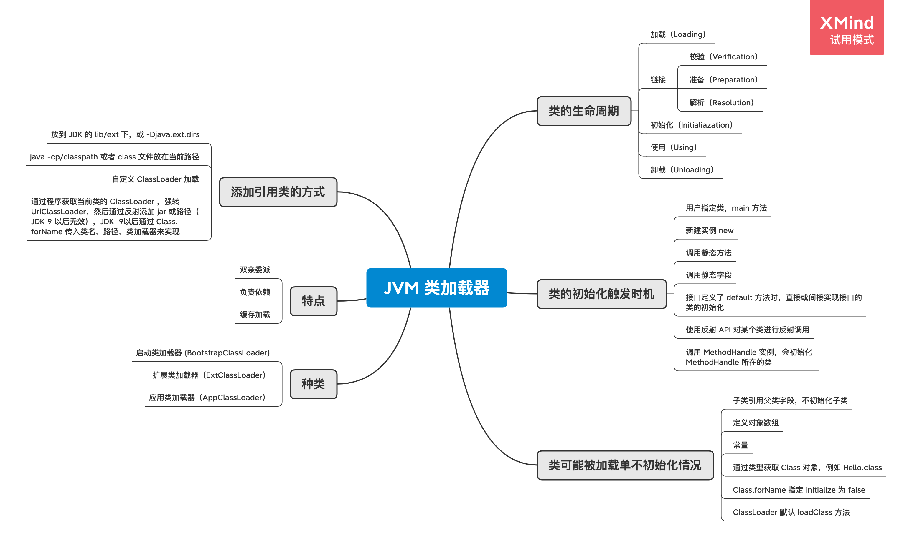
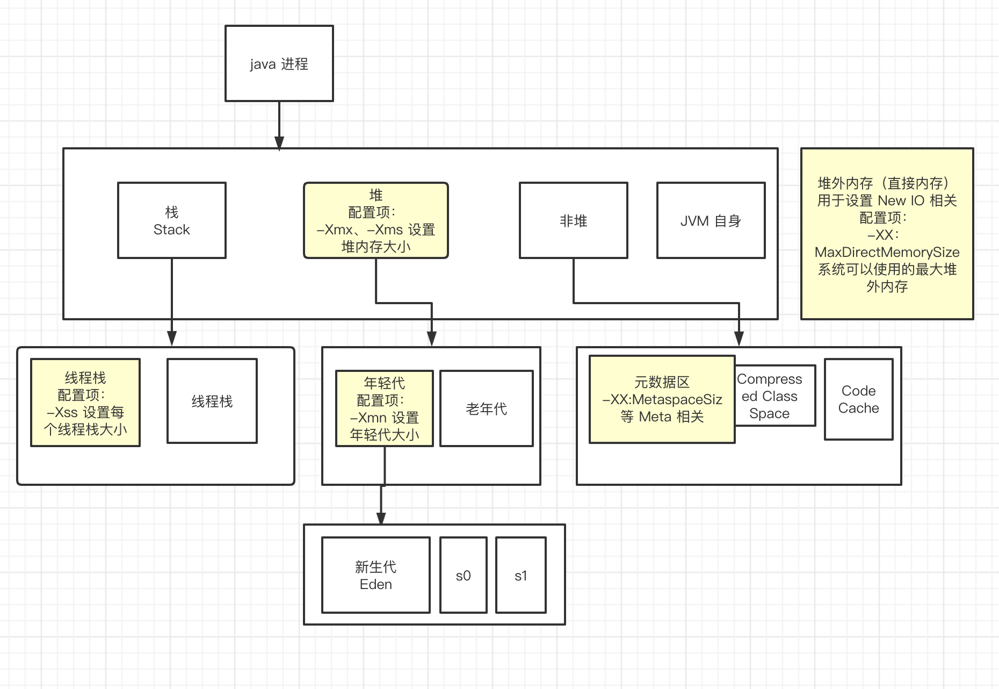

## jvm 总结

### 脑图

1. 垃圾回收

2. 类加载器

3. 内存模型

### JVM 类加载器

#### 类的生命周期

1. 加载（Loading）：在 classpath 或者其他途径下找到 Class 文件，查找字节流，并根据此创建类的过程，基本数据类型是有 java 虚拟机预先定义好的，引用类型中类和接口需要获取字节流，数组类是 java 虚拟机直接生成的。
2. 验证（Verification）：验证格式，确保被加载类满足 java 虚拟机的约束条件，同时去检查依赖
3. 准备（Preparation）：创建静态字段，并将其初始化为默认值（例如 null ），并为静态字段分配内存空间。
4. 解析（Resolution）：将符号引用解析为实际引用。
5. 初始化（Initialization）：执行类构造器方法、静态变量赋值、执行 static 静态代码块。
6. 使用（Using）
7. 卸载（Unloading）

注：其中 2-4 步可以合并成为 链接

#### 类的初始化触发时机

1. 当虚拟机启动的时候，初始化用户指定的类，就是启动执行的 main 方法所在的类。
2. 当遇到用以新建实例的 new 指令时，初始化 new 指令的目标类，也就是 new 一个类的时候要初始化。
3. 当遇到静态方法的指令时，初始化该静态方法所在的类。
4. 当遇到静态字段的指令时，初始化静态字段所在的类。
5. 子类的初始化会触发父类的初始化。
6. 如果一个接口定义了 default 方法，那么直接实现或者间接实现接口的类的初始化，会触发接口的初始化。
7. 使用反射 API 对某个类进行反射调用时，初始化这个类。
8. 当初次调用 MethodHandle 实例时，初始化该 MethodHandle 指向的方法所在的类。

#### 类不会初始化情况（可能会被加载）

1. 通过子类引用父类的静态字段，只会触发父类的初始化，而不会触发子类的初始化。
2. 定义对象数组，不会触发类的初始化
3. 常量在编译期间会存入调用类的常量池中，本质上并没有直接引用定义常量的类，不会触发定义常量所在的类
4. 通过类型获取 Class 对象，不会触发类的初始化，Hello.class 不会让 Hello 类初始化。
5. 通过 Class.forName 加载指定类时，如果指定参数 initialize 为 false 时，也不会触发类初始化，这个参数是告诉虚拟机是否要对类进行初始化，默认 initialize 为 true。
6. 通过 ClassLoader 默认的 loadClass 方法，也不会触发初始化动作（加载了，但是不会初始化）。

#### 类加载器的种类

1. 启动类加载器（BootstrapClassLoader）：JVM 内部实现，用原生 C++ 代码来实现的，并不继承 java.lang.ClassLoader，负责加载JDK中 jre/lib/rt.jar 里的所有 class，和其他一些 jar 包（主要是 rt.jar）。
2. 扩展类加载器（ExtClassLoader）：负责加载 JRE 的扩展目录，lib/ext 或者由 java.ext.dirs 系统属性指定的目录中的 JAR 包的类。
3. 应用类加载器（AppClassLoader）：加载来自 Java 命令的 -classpath 或者 -cp 选项、java.class.path 系统属性指定的 jar 包和类路径、用户自定义的类。

#### 类加载器的特点

1. 双亲委派

   当一个自定义类加载器需要加载一个类的时候，会先去委托自己的父加载器加载，父加载器如果发现还有自己的父加载器，则会一直向上寻找，如果上级类加载器加载了这个类，则所有的子加载器不需要继续加载，如果几个类加载器都没有找到指定的类，则会抛出 ClassNotFoundException 异常。

2. 负责依赖

   如果一个加载器在加载某个类的时候，发现这个类依赖于另外几个类或接口时，也会尝试去加载这些依赖项。

3. 缓存加载

   已经被类加载器加载过的类，会缓存加载结果，不会重复加载。

#### 添加引用类的方式

1. 放到 JDK 的 lib/ext 下，或者 -Djava.ext.dirs。
2. java -cp/classpath 或者 class 文件放到当前路径进行执行。
3. 自定义 ClassLoader 加载。
4. 通过程序，获取当前执行类的 ClassLoader ，强转成 UrlClassLoader ，再通过反射调用 addUrl 方法添加 Jar 或路径（JDK9 无效），JDK 9 中可以通过 Class.forName 里传入类名、路径、对应的类加载器来加载指定的引用类。

### JVM 内存模型

#### 根据是否线程私有划分

1. 线程私有的

   程序计数器器

   虚拟机栈

   本地方法栈

2. 线程共享的

   堆

   方法区（jdk 1.8 后移除，改为 元数据区(Metaspace)）

   直接内存

#### 程序计数器

​		字节码解释器工作时，通过改变程序计数器的值来选取下一条要执行的指令，分支、循环、跳转、异常处理、线程恢复等功能都需要依赖这个计数器来完成。

​		每个线程都会有自己独立的程序计数器，各线程之间计数器互不影响。

作用：

1. 字节码解释器通过程序计数器来依次读取指令，从而实现代码的流程控制，如：顺序执行、选择、循环、异常处理。
2. 在多线程环境下，程序计数器用于记录当前线程的执行位置，所以当线程被切换回来的时候，可以知道上次运行到哪。

#### 虚拟机栈（java 栈）

​		每个线程都有自己的线程栈（也叫做 Java 方法栈），每执行一个方法都会创建一个栈帧，所以每个线程栈是由多个栈帧组成，而每个栈帧中又包含了：局部变量表、操作数栈、动态链接、方法出口信息。

​		虚拟机栈的局部变量表中主要存放：**原生数据类型的局部变量、对象引用**。

#### 本地方法栈

​		使用了 JNI 方法时，会分配本地方法栈，由于 JNI 方法会调用一些底层的例如 c++ 的代码，所以通过 c++ 运行占用的一些内存也不在 JVM 管理范围内。

#### 堆

​		在 hotspot 虚拟机中，堆被分为年轻代（Young generation）和老年代（Old generation），其中年轻代还划分为3个内存池，新生代（Eden space）和存活区（Survivor space）。大部分 GC 算法中，有2个存活区（S0,S1），任何时刻，S0 和 S1 总有一个是空的。不同 GC 下，年轻代与老年代的占比是不同的，并行 GC 下是 1:2（年轻代:老年代），CMS 下年轻代的最大堆内存不一样，如果是64位的机器就是 64MB * 并行GC的线程数 * 一个系数 / 10 这样计算出来的一个值。

​		年轻代主要**存放新创建的对象**，如果新创建的对象在新生代中满了，就会放到存活区，如果一个存活区满了，就会在触发 gc 之后，将该存活区剩余的对象全部挪到另外一个存活区中。

​		老年代主要**存放创建的对象占用空间大的对象和存活时间长的对象**。

​		堆中主要存放 **Java 代码中创建的所有对象，也包括包装类型（Integer、Boolean 等），同时包含在 1.7 版本后从运行时常量池中分出来的字符串常量池**。

#### 非堆

##### 元数据区（Metaspace）

​		jdk 1.8 以前是方法区，jdk 1.8 之后主要存放**已被虚拟机加载的类信息、运行时常量池（不包含字符串常量池）中的常量、静态变量、即时编译器编译后的代码等数据**，在 jdk 1.8 以前，方法区的实现是永久代，并放在堆中。

##### CCS （Compressed Class Space）

​		存放 class 信息的，与 Metaspace 有交叉。

##### Code Cache

​		存放 JIT 编译器编译后的本地机器码

### JDK 内置命令行工具

#### JVM 命令行工具

| 工具          | 简介                                                         |
| ------------- | ------------------------------------------------------------ |
| java          | java 应用的启动程序                                          |
| javac         | JDK 内置的编译工具                                           |
| javap         | 反编译 class 文件的工具                                      |
| javadoc       | 根据 java 代码和标准标注，自动生成相关的 API 说明文档        |
| javah         | JNI 开发时，根据 java 代码生成需要的 .h 文件                 |
| extcheck      | 检查某个 jar 文件和运行时扩展 jar 有没有版本冲突，很少使用   |
| jdb           | java debugger；可以调试本地和远端程序，属于 JPDA 中的一个 demo 实现，供其他调试器参考。开发时很少使用 |
| jdeps         | 探测 class 或 jar 包需要的依赖                               |
| jar           | 打包工具，可以将文件和目录打包成为 .jar 文件；.jar 文件本质上就是 zip 文件, 只是后缀不同。使用时按顺序对应好选项和参数即可。 |
| keytool       | 安全证书和密钥的管理工具; （支持生成、导入、导出等操作）     |
| jarsigner     | JAR 文件签名和验证工具                                       |
| policytool    | 实际上这是一款图形界面工具, 管理本机的 Java 安全策略         |
| **jps/jinfo** | 查看 Java 进程                                               |
| **jstat**     | 查看 jvm 内部 gc 相关信息                                    |
| **jmap**      | 查看 heap 或类占用空间统计                                   |
| **jstack**    | 查看线程信息                                                 |
| **jcmd**      | 执行 jvm 相关分析命令（整合命令）                            |
| runscript/jjs | 执行 js 命令                                                 |

### GC

#### 判断对象是否存活算法

1. 引用计数法

   ​		给对象添加一个引用计数器，每当有一个地方引用它的时候 +1，引用失效的时候减1，如果当计数器值为 0 之后，就无法再引用该对象，因为已经获取不到这个对象了。但是该方法无法解决两个对象之间相互循环引用造成的问题。

2. 可达性分析算法

   ​		从 GC Roots 作为根节点出发，向下搜索，节点所走过的链接为引用链，如果一个对象到 GC Roots 没有任何引用链相连的话，这个对象就是不可用的。

   ​	可作为 GC Roots 的对象：

   ​		1) 当前正在执行的方法里的局部变量和输入参数

   ​		2) 活动线程（Active threads）

   ​		3) 已加载类的静态字段

   ​		4) JNI 引用

#### 垃圾回收的三种方式

1. 清除算法

   ​	标记完存活对象之后，将不可用的对象所占据的内存标记为空闲内存，并记录在一个空闲列表（free list）之中，当有新的对象创建的时候，内存管理模块便会从该空闲列表中寻找空闲内存，并划分给新建的对象。

   ​	缺点：1. 会造成内存碎片。因为堆中的对象是连续分布的，可能会出现当前的空闲列表中没有连续的空间分配给新的对象的情况，也就是明明有足够的空间，但是无法分配。2. 分配效率低。Java 需要逐个访问空闲列表中的项，来查找能够放入新建对象的空闲内存。

2. 压缩算法

   ​	将存活对象聚集到内存区域的起始位置，从而留下一块连续的内存空间，通过该方法解决了内存碎片问题，但是代价是压缩算法带来的性能开销。

3. 复制算法

   ​	即把内存区域分为两等分，分别用两个指针 from 和 to 来维护，并且只是用 from 指针指向的内存区域来分配内存。当发生垃圾回收时，便把存活的对象复制到 to 指针指向的内存区域中，并且交换 from 指针和 to 指针的内容。复制这种回收方式同样能够解决内存碎片化的问题，但是它的缺点也极其明显，即堆空间的使用效率极其低下。

#### 垃圾收集器

##### Serial GC 和 Serial Old GC

​	新生代使用 Serial 收集器，老年代使用 Serial Old 收集器，新生代中采用的是标记-复制算法，老年代中采用的是标记-整理算法。都是只用一个线程进行垃圾回收，在垃圾回收时会触发 STW 事件。

##### Parallel GC（并行 GC）

​	新生代中有 Parallel New 和 Parallel Scavenge ，老年代中是 Parallel Old。相当于 Serial GC 的多线程版，新生代中采用的是标记-复制算法，老年代中采用的是标记-整理算法，在垃圾回收时也会触发 STW 事件。Parallel Scavenge GC 比 Parallel New 更加注重吞吐量（ 应用运行时间 /(应用运行时间 + 垃圾回收时间) ，高吞吐量就是说运行应用的时间占比大），它提供了很多参数来帮用户找到最合适的停顿时间或最大吞吐量。由于 Parallel Scavenge 的侧重点与 CMS 不同，同时该垃圾收集器的底层设计没有采用 hotspot 中原本的分代框架，所以无法与 CMS 配合工作。并行 GC 在两次 GC 周期的间隔期，没有 GC 线程在运行，不会消耗任何系统资源。

​	并行 GC 默认的线程数为当前 CPU 的核数，可以通过 -XX:ParallelGCThreads=N 来指定 GC 线程数。在使用 -XX:+useParalelGC 的时候新生代使用的是 Parallel Scavenge GC。

##### CMS GC

​	CMS 是一种已获取最短回收停顿时间为目标的收集器，是 HotSpor 虚拟机第一款真正意义上的**并发收集器**，它是属于老年代的垃圾收集器，一般与年轻代的 Parallel New GC 配合使用，采用的是标记-清除算法，通过空闲列表来管理内存空间的回收。当 CMS 失败的时候，会退化为 serial old gc，退化时日志中会显示 concurrent mode failure ，其代表退化时候的 full gc。

​	默认情况下，CMS 使用的并发线程数等于 CPU 核心数的 1/4。

​	如果服务器是多核 CPU，并且主要调优目标是降低 GC 停顿导致的系统延迟，那么可以考虑使用 CMS ，不过 CMS 在 jdk9 以后已经被废弃。

##### G1 GC

​	G1 GC 也是一个并发的 GC，全称为 Garbage-First，意为垃圾优先，哪一块的垃圾最多就优先清理它。

​	G1 GC 的设计目标是将 STW 停顿的时间和分布变成可预期可配置的。

​	G1 是一个横跨新生代和老年代的垃圾回收期。它将堆划分为多个（通常是 2048 个）可以存放对象的小块堆区域（smaller heap regions）。每个区域都可以充当 Eden 区、Survivor 区或者 Old 区中的一个。逻辑上，所有的 Eden 区和 Surivivor 区合起来是年轻代，所有的 Old 区拼在一起就是老年代。

​	G1 不必每次都去收集整个堆空间，而是以增量的方式来进行处理，每次只处理一部分内存块，这些被处理的内存块称为回收集（Collection set），构建回收集的原则是垃圾最多的小块会被优先收集。每次 GC 暂停都会收集所有的年轻代的内存块，但一般只包含部分老年代的内存块。G1 会在并发阶段估算每一个小堆存活对象的总数，垃圾最多的小块会被优先收集。

##### ZGC 介绍

目前只能在 linux 上使用该 GC

通过着色指针和读屏障，实现几乎全部的并发执行，几毫秒级别的延迟，线性可扩展

##### ShennandoahGC 介绍

​	设计为 GC线程与应用线程并发执行的方式，通过实现垃圾回收过程的并发处理，改善停顿时间， 使得GC执行线程能够在业务处理线程运行过程中进行堆压缩、标记和整理，从而消除了绝大部分的暂停时间。

​	Shenandoah 团队对外宣称Shenandoah GC的暂停时间与堆大小无关，无论是200 MB 还是 200 GB的堆内存，都可以保障具有很低的暂停时间（注意:并不像ZGC那样保证 暂停时间在10ms以内）。

