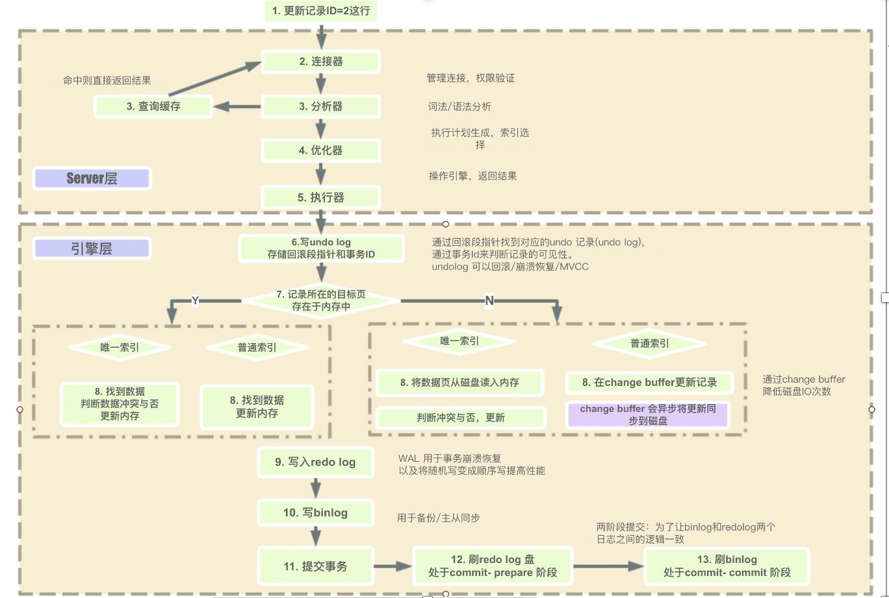

# mysql 总结

### MySql InnoDB 引擎执行流程

### MySQL 执行引擎和状态

| 存储引擎 | myisam | innodb | memory       | archive |
| -------- | ------ | ------ | ------------ | ------- |
| 存储限制 | 256TB  | 64TB   | 根据内存决定 | 无      |
| 事务     | -      | 支持   | -            | -       |
| 索引     | 支持   | 支持   | 支持         | -       |
| 锁的粒度 | 表锁   | 行锁   | 表锁         | 行锁    |
| 数据压缩 | 支持   | -      | -            | 支持    |
| 外键     | -      | 支持   | -            | -       |

### 事务隔离级别

MySQL 可以 1. 设置全局的默认隔离级别 ；2. 可以单独设置会话的隔离级别。 

#### 读未提交（READ UNCOMMITTED）

定义：

​	事务与事务之间的修改相互可见，某个事务能够读到另一个事务还未提交状态的修改等操作的信息，如果另一个事务之后回滚不提交，则会产生脏读。

特点：

 	1. 很少使用
 	2. 不能保证一致性
 	3. 脏读：使用到未被确认的数据

锁情况:

1. 以非锁方式执行
2. 可能产生的问题：脏读、幻读、不可重复读

#### 读已提交（READ COMMITTED）

定义：

​	其他事务读到的数据是别的事务已经提交的状态的，如果别的事务未提交，那么其他事务也看不到。读已提交可能会多次读到的数据不一样，因为当 事务A 读取到了数据的时候，可能另一个 事务B 刚好插入了一些新的数据并提交，此时 事务A 无法看到新的数据，但是如果 事务A 再一次读数据的时候，因为 事务B 已经提交了插入新数据的事务，此时又能读到新的数据。

特点：

 	1. 每次查询都会设置和读取自己的新快照
 	2. 仅支持基于行的 bin-log
 	3. UPDATE 优化：半一致读（官方已去掉）
 	4. 不可重复度：不加锁的情况下，其他事务 update 或 delete 会对查询结果有影响
 	5. 幻读：加锁后，不锁定间隙，其他事务可以 INSERT

锁情况：

1. 锁定索引记录，而不锁定记录之间的间隙
2. 可能的问题：幻读、不可重复读

#### 可重复读（REPETABLE READ）

定义：

​	多次读取的数据都是一样的。

特点：

1. InnoDB 的默认隔离级别
2. 使用事务第一次读取时会创建一个快照
3. 多版本技术（MVCC）

锁情况：

1. 使用唯一索性的唯一查询条件时，只锁定查找到的索引记录，不锁定间隙
2. 其他查询条件，会锁定扫描到的索引范围，通过间隙锁或临键锁来阻止其他会话在这个范围中插入值
3. 可能的问题：InnoDB 不能保证没有幻读，需要加锁

#### 可串行化（SERIALIZABLE）

定义：

​	每一个事务必须挨个执行，无法并发执行

特点：

​	最严格的级别，事务串行执行，资源消耗最大，可解决脏读、不可重复度和幻读。

### Log

undo log 保障回滚、redo log 保障数据不丢失

#### undo log（撤销日志）

特点：

1. 保证事务的原子性
2. 用处：事务回滚，一致性读，崩溃恢复
3. 记录事务回滚时所需的撤销操作
4. 一条 INSERT 语句，对应一条 DELETE 的 undo log
5. 每个 UPDATE 语句，对应一条相反 UPDATE 的 undo log

保存位置：

1. system tablespace（MySQL 5.7 默认）
2. undo tablespaces（MySQL 8.0 默认）

#### redo log（重做日志）

特点：

1. 确保事务的持久性，防止事务提交后数据未刷新到磁盘就掉电或崩溃，因为在提交事务的时候，是先写入到 redo log 中，之后再写入到磁盘中的，所以如果 mysql 宕机了，之后再重启，它也可以通过 redo log 来重新执行剩下的操作
2. 事务执行过程中写入 redo log，记录事务对数据页做了哪些修改
3. 提升性能：WAL（Write-Ahead Logging）技术，先写日志，再写磁盘
4. 日志文件：ib_logfile0，ib_logfile1
5. 日志缓冲：innodb_log_buffer_size
6. 强刷：fsync()

### MVCC （多版本并发控制）

特点：

1. 使 InnoDB 支持一致性读：READ COMMITTED 和 REPEATABLE READ
2. 让查询不被阻塞、无需等待被其他事务持有的锁，从而增加并发性能
3. InnoDB 保留被修改行的旧版本
4. 查询正在被其他事务更新的数据时，会读取更新之前的版本
5. 每行数据都存在一个版本号，每次更新时都更新该版本
6. 这种技术在数据库领域的使用并不普遍，某些数据库，以及某些 MySQL 存储引擎都不支持

实现机制：

1. 隐藏列，2个隐藏列，一个保存当前行的创建时间，一个保存当前行的过期时间（删除时间），当然存的不是时间值，而是系统版本号
2. 事务链表，保存还未提交的事务，事务提交则会从链表中摘除
3. Read view
4. 回滚段：通过 undo log 动态构建旧版本数据

### 索引模型

#### 哈希表

​	一种以键 - 值（key-value）存储数据的结构，我们只要输入待查找的键即 key，就可以找到其对应的值即 Value。哈希的思路很简单，把值放在数组里，用一个哈希函数把 key 换算成一个确定的位置，然后把 value 放在数组的这个位置。多个 key 值经过哈希函数的换算，会出现同一个值的情况。处理这种情况的一种方法是，拉出一个链表。

​	因为不是有序的，所以哈希索引做区间查询的速度是很慢的。

​	哈希表这种结构适用于只有等值查询的场景

#### 有序数组

​	仅仅看查询效率，有序数组就是最好的数据结构了。但是，在需要更新数据的时候就麻烦了，你往中间插入一个记录就必须得挪动后面所有的记录，成本太高。有序数组索引只适用于静态存储引擎，比如你要保存的是 2017 年某个城市的所有人口信息，这类不会再修改的数据。

#### 搜索树

​	二叉搜索树的特点是：父节点左子树所有结点的值小于父节点的值，右子树所有结点的值大于父节点的值。N 叉树由于在读写上的性能优点，以及适配磁盘的访问模式，已经被广泛应用在数据库引擎中了。InnoDB 使用了 B+ 树索引模型，所以数据都是存储在 B+ 树中的。

### 主从复制

#### 核心

1. 主库将数据库的增删改、DDL操作等写入 binlog
2. 从库从主库拉 binlog 写入 relay log

#### 异步复制

​	主库写完 binlog 后才会 commit，从库异步的去主库中把 binglog 拉下来，转为本地的 relay log ，最后从库将主库的数据在从库提交。当网络或机器故障时，会造成数据不一致。

#### 半同步复制

​	至少有一个从库将主库的 binlog 读取了之后发送 ACK，主库才 commit。

#### 组复制（MySQL Group Replication（MGR））

​	通过 Paxos 协议来实现。

特点：

1. 高一致性：基于分布式 Paxos 协议实现组复制，保证数据一致性
2. 高容错性：自动检测机制，只要不是大多数节点都宕机就可以继续工作，内置防脑裂保护机制
3. 高扩展性：节点的增加与移除会自动更新组成员信息，新节点加入后，自动从其他节点同步增量数据，直到与其他节点数据一致
4. 高灵活性：提供单主模式和多主模式，单主模式在主库宕机后能够自动选主，所有写入都在主节点进行，多主模式支持多节点写入。