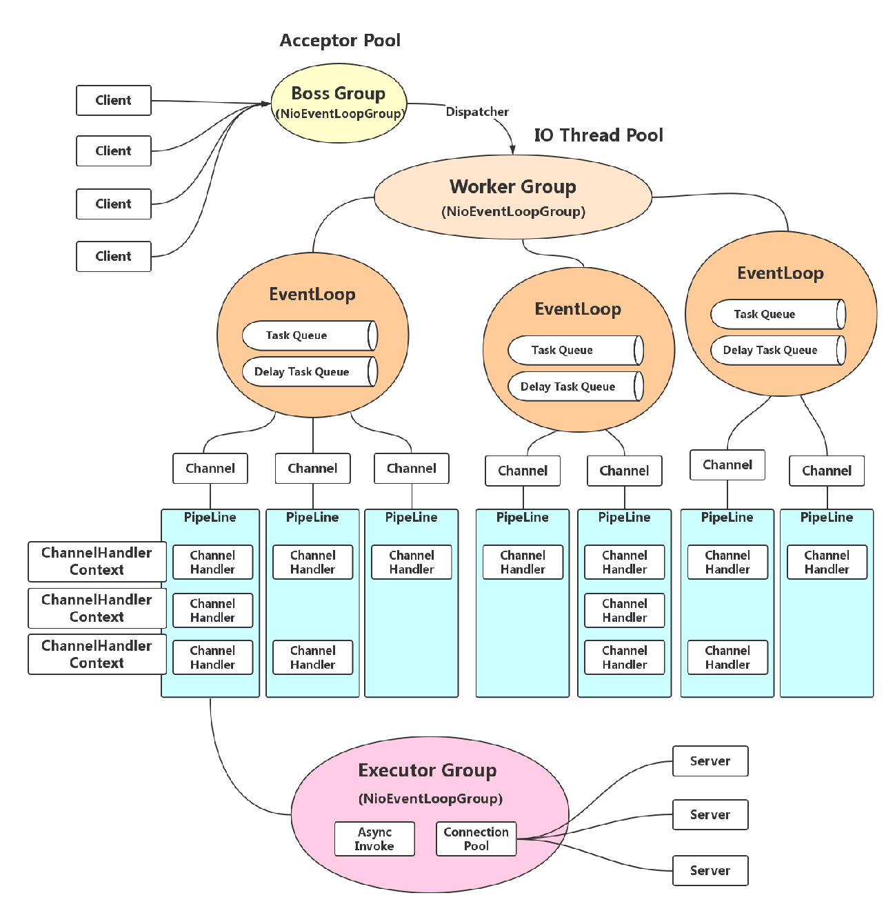

## nio 总结

### netty 运行原理图

### 同步与异步

​		同步与异步是通信模式，同步表示的是一个调用者发起调用后要一直等待着，等到消息返回之后才能继续下面的步骤，异步则是发起调用后就直接返回了，可以继续处理别的事情，被调用者通过状态、通知和回调来通知调用者。

### 阻塞和非阻塞

​		阻塞和非阻塞是线程处理模式，阻塞调用了话线程会一直挂起，等到返回了才能继续当前的线程，非阻塞则不会阻塞当前线程。

### Linux 几种 IO 模型

#### 1. 同步阻塞 IO（BIO）

##### 流程描述

​		当用户调用 recv()/recvfrom() 时，kernel 开始进入第一个阶段准备阶段（对于网络 IO 来说，很多时候数据一开始还没有到达，这个时候 kernel 就要等待足够的数据到来），这个过程需要等待，也就是说数据拷贝到操作系统内核的缓冲区中需要一个过程。而在用户进程这边，整个进程会被阻塞。**第二个阶段：当 kernel 中数据准备好了，它就会将数据从 kernel 中拷贝到内存**，然后 kernel 返回结果，用户进程接触 block 状态，重新运行起来。

##### 优点

​	能够及时返回数据

##### 缺点

​	用户需要等待一定时间

#### 2. 同步非阻塞 IO

##### 流程描述

​		当用户发起 read 操作时，如果 kernel 没有准备好，会直接返回一个 error，并不会 block 用户进程，用户可以根据返回结果判断是否 error，如果数据还没有准备好，就可以再次发送 read 操作，一旦 kernel 准备好了，并且又再次收到了用户进程的 system call ，那么它马上就将数据拷贝到用户内存中，然后返回。

##### 优点

​		应用进程可以在等待的时间内做其他事

##### 缺点

​		任务完成的响应延迟大了，因为可能在两次轮询之间的任意时间完成，导致吞吐量降低。

#### 3. IO 多路复用

##### 定义

​		由于同步非阻塞方式需要不断主动轮询，轮询占据了很大一部分过程，会消耗大量的CPU时间，并且 “后台” 可能有多个任务在同时进行。

​		此时，人们就想到如果可以查询多个任务的完成状态，只要有任何一个任务完成，就去处理它。如果轮询不是进程的用户态，而是有人帮忙就好了。那么这就是所谓的 “IO 多路复用”。UNIX/Linux 下的 select、poll、epoll 就是干这个的（epoll 比 poll、select 效率高，做的事情是一样的）。

​		select 调用时内核级别的，相对非阻塞的轮询的区别在于，**select 调用可以等待多个 socket，能实现同时对多个 IO 端口进行监听，**当其中任何一个 socket 的数据准备好了，就能返回进行可读，然后进程再进行 recvform 系统调用，将数据由内核拷贝到用户进程，这个过程也是阻塞的。

​		select、poll、epoll 这几个函数可以阻塞多个 I/O 操作，而且可以同时对多个读操作，多个写操作的 I/O 函数进行监测，直到有数据可读或可写时，才真正调用 I/O 操作函数。

​		但是由于管理了多个 IO，所以多个 IO 之间的顺序变得不确定了。

#### 4. 信号驱动 IO

##### 定义

​		信号驱动 IO 不会阻塞用户进程，用户进程需要等待数据的时候，会像内核发送一个信号，并且用户进程有一个信号处理函数，发送完信号之后，用户进程就可以做别的事情了。当内核将数据准备好之后，会发给进程一个信号，此时，用户进程可以通过调用信号处理函数，可以在信号处理函数中调用 recefrom ，去处理数据。

#### 5. 异步非阻塞 IO

##### 定义

​		用户进程发出系统调用之后就直接返回，内核等待数据准备完成后，将数据拷贝到用户进程缓冲区，然后发送信号告诉告诉用户进程 IO 操作执行完毕，与信号驱动 IO 不同的是异步非阻塞 IO 前者是告诉用户进程数据准备完毕，后者直接告诉用户进程 IO 操作完毕。

### NIO 三大组件

#### Buffer

​		一个 Buffer 本质上是内存中的一块，可以将数据写入这块内存，之后再从这块内存中读取数据。

#### position、limit、capacity

​		Buffer 的操作方法和数组差不多，访问元素时也需要指定下标。

##### position

​		初始值是 0，每写入或读一个值时，自动加1，代表下一个要写入的位置

##### capacity

​		表示这个 Buffer 能存放的最大容量

##### limit

​		写操作模式下，limit 代表的是最大能写入的数据，这个时候 limit 等于 capacity。写结束后，切换到读模式，此时的 limit 等于 buffer 中实际的数据大小。

#### Channel

##### FileChannel

​		FileChannel 不支持非阻塞

##### SocketChannel

​		可以理解成一个 TCP 客户端

##### ServerSocketChannel

​		可以理解为一个服务端

##### DatagramChannel

​		一个类处理了服务端和客户端

#### Selector

​		多路复用在 java 中指的就是它，用于实现一个线程管理多个 Channel

