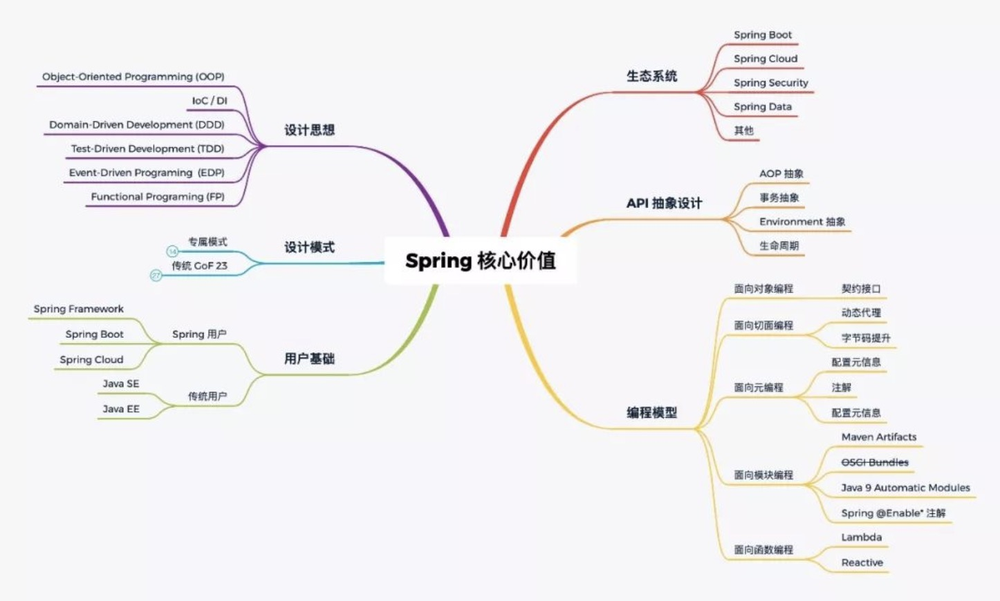

# Spring 和 orm 总结

## IOC 容器

### 单一类型依赖查找

#### 单一类型依赖查找接口- BeanFactory

1. 根据Bean名称查找

​		getBean(String)

​		spring 2.5 覆盖默认参数： getBean(String,Object...args) 该方法可以重新通过构造函数返回新的对象，建议不使用，因为每次都会返回新的对象

2. 根据Bean类型查找

   1) Bean 实时查找

   ​		Spring 3.0 getBean(Class)

   ​		Spring 4.1 覆盖默认参数：getBean(Class, Object...args) 同上，不建议使用

   2) Spring 5.1 Bean 延迟查找：返回ObjectProvider，ObjectProvider继承了ObjectFactory，通过objectProvider 的getObject方法获取对象，同时ObjectProvider也提供了安全的依赖查找模式。

   ​		getBeanProvider(Class)

   ​		getBeanProvider(ResolvableType)

3. 根据 Bean 名称+类型查找：getBean(String,Class)

### 集合类型依赖查找

#### 集合类型依赖查找接口- ListableBeanFactory

1. 根据 Bean 类型查找

   1) 获取同类型 Bean 名称列表

   ​		getBeanNamesForType(Class)： 该类型的子类也会获取到，判断通过FactoryBean和BeanDefinition来进行判断，并未将 bean 进行初始化。

   ​		Spring 4.2 getBeanNamesForType(ReolvableType)： 泛型操作

   2) 获取同类型 Bean 实例列表

   ​		getBeansOfType(Class)以及重载方法：该方法会提前初始化bean，可能会出现依赖的问题导致报错

2. 根据注解类型查找

   1) Spring 3.0 获取标注类型 Bean 名称列表

   ​		getBeanNamesForAnnotation(Class<? extends Annotation>)

   2) Spring 3.0 获取标注类型 Bean 实例列表

   ​		getBeansWithAnnotation(Class<? extends Annotation>)

   3) Sptring 3.0 获取单个指定名称 + 标注类型 Bean 实例

   ​		findAnnotationOnBean(String, Class<? extends Annotation>)

### 层次性依赖查找

#### 层次性依赖查找接口 - HierarchicalBeanFactory

HierarchicalBeanFactory <- ConfigurableBeanFactory <- ConfigurableListableBeanFactory

1. 双亲 BeanFactory：getParentBeanFactory()

2. 层次性查找

   1) 根据 Bean 名称查找

   ​		基于 containsLocalBean 方法实现，判断当前 beanFactory 是否包含某类对象

   2) 根据 Bean 类型查找实例列表

   ​		单一类型：BeanFactoryUtils#beanOfType

   ​		集合类型：BeanFactoryUtils#beansOfTypeIncludingAncestors

   3) 根据 java 注解查找名称列表

   ​		BeanFactoryUtils#beanNamesForTypeIncludingAncestors

### 延迟依赖查找

#### Bean 延迟依赖查找接口

1. org.springframework.beans.factory.ObjectFactory

2. org.springframework.beans.factory.ObjectProvider

   ObjectProvider 在 Spring 5 对 java 8 特性扩展

   ​		1) 函数式接口

   ​				getIfAvaliable(Supplier)

   ​				ifAvailable(Consumer)

   ​		2) Stream 扩展 - stream()

   ​				ObjectProvider 继承了 Iterable，并提供了 stream() 方法

#### 依赖注入的模式和类型

##### 依赖注入模式

###### 手动模式 - 配置或者编程的方式，提前安排注入规则

1. XML 资源配置元信息
2. Java 注解配置元信息
3. API 配置元信息

###### 自动模式 - 实现方提供依赖自动关联的方式，按照内建的注入规则

Autowiring （自动绑定）

##### 依赖注入类型

| 依赖注入类型 | 配置元数据类型                                 |
| ------------ | ---------------------------------------------- |
| Setter 方法  | <property name="user" ref="userBean" />        |
| 构造器       | <constructor-arg name="user" ref="userBean" /> |
| 字段         | @Autowired User user;                          |
| 方法         | @Autowired public void user(User user) {...}   |
| 接口回调     | class MyBean implements BeanFactoryAware{...}  |

BeanFactoryAware 会传递一个 beanFactory 进来，通过 beanFactory 将对应的对象进行注入

### Spring Bean 生命周期

#### Spring Bean 元信息配置阶段

BeanDefinition 配置

1). 面向资源:

​	xml 配置

​	Properties 资源配置

2). 面向注解

3). 面向 API

#### Spring Bean 元信息解析阶段

1. 面向资源 BeanDefinition 解析

   ​	BeanDefinitionReader

   ​	XML 解析器 - BeanDefinitionParser

2. 面向注解 BeanDefinition 解析

   AnnotatedBeanDefinitionReader

#### Spring Bean 注册阶段

BeanDefinition 注册接口

​	BeanDefinitionRegistry#registerBeanDefinition

​	详情见 DefaultListableBeanFactory#registerBeanDefinition，DefaultListableBeanFactory 实现了 BeanDefinitionRegistry，有个注意点是，BeanFactory 通过 beanDefinitionMap 来存储 beanDefinition，另外通过 beanDefinitionNames 管理 beanDefinition 的注册顺序

#### Spring BeanDefinition 合并阶段

1. BeanDefinition 合并

   父 BeanDefinition 合并

   ​	当前 BeanFactory 查找

   ​	层次性 BeanFactory 查找

   ​	入口：ConfigurableBeanFactory#getMergedBeanDefinition，唯一实现类 AbstractBeanFactory#getMergedBeanDefinition，会先查找当前 beanFactory 是否有该 beanName 的 beanDefinition，如果没有，则去父 beanFactory 上查找，一个递归调用。后面调用 getMergedLocalBeanDefinition 方法，在调用该方法的时候，所有的 beandefinition 都是 GenericBeanDefinition，通过getMergedBeanDefinition 调用之后返回成 RootBeanDefinition，spring 在创建 RootBeanDefinition 的时候，是通过 new RootBeanDefinition(bd) 传入当前的 GenericBeanDefinition，重新复制一个 RootBeanDefinition，做到不影响原来的 BeanDefinition。

#### Spring Bean Class 加载阶段

1. ClassLoader 类加载

   ​		BeanFactory 在调用完 getMergedBeanDefinition 合并 BeanDefinition 之后，会进入到类加载阶段。具体入口 AbstractBeanFactory#doGetBean中，该方法内会调用 getMergedLocalBeanDefinition，进行 BeanDefinition 的合并，BeanDefinition 合并完成之后经过一些其他的判断，之后会有一个判断（ mbd.isSingleton() 方法）判断该 BeanDefnition 是否为单例，如果为单例就会调用 getSingleton(String beanName, ObjectFactory<?> singletonFactory) 方法进行 Bean 的实例化，Class 类的加载就在singletonFactory#getObject方法中，ObjectFactory 是个接口，spring 使用了 lambda 表达式，调用了 AbstractAutowireCapableBeanFactory#createBean 方法，在createBean 方法中，会调用 resolveBeanClass 方法来生成 Class 对象，resolveBeanClass 中有 Java Security 安全控制，可以通过 Java 安全控制来判断是否能够生成该 Class 对象，之后会调用 doResolveBeanClass 方法，该方法会通过 Java 自带的 ClassLoader 来创建 Class 对象，并返回。

   具体流程：

   ​		AbstractBeanFactory#doGetBean() -> getSingleton() -> singletonFactory#getObject()-> AbstractAutowireCapableBeanFactory#createBean() -> AbstractBeanFactory#resolveBeanClass() -> doResolveBeanClass() 生成 Class 对象。

2. Java Security 安全控制

3. ConfigurableBeanFactory 临时 ClassLoader

#### Spring Bean 实例化前阶段

1. 非主流生命周期 - Bean 实例化前阶段

   InstantiationAwareBeanPostProcessor#postProcessBeforeInstantiation

   具体调用地方：在Spring Bean Class 加载阶段之后，即在调用 createBean 的 resolveBeanClass() 之后，有一个 resolveBeforeInstantiation() 方法，该方法内有一个 applyBeanPostProcessorsBeforeInstantiation() 方法会循环去寻找当前注入到 IOC 容器中的所有实现 InstantiationAwareBeanPostProcessor 接口的类对象，只要有一个实现该接口的对象返回不为 null ，则直接返回 postProcessBeforeInstantiation() 方法的返回值，如果有返回值，则不会执行外部( createBean方法中 )的后续 doCreateBean() 方法创建实例

#### Spring Bean 实例化阶段

1. 实例化方式

   在 Spring Bean 实例化前阶段判断完成之后，调用 doCreateBean() 方法

   1. 传统实例化方式

      实例化策略（方法）：InstantiationStrategy

      步骤：

      ​		调用 AbstractAutowiredCapableBeanFactory#doCreateBean() ，该方法内调用 createBeanInstance() ，createBeanInstance() 会去判断当前的 BeanDefinition 是否是通过构造器依赖注入的，如果不是，则用传统的实例化方法 instantiateBean ，instantiateBean 方法内部会通过调用 instantiateBean 来获取 InstantiationStrategy ，然后通过调用该对象的 instantiate 方法来获取 bean 实例，但是并不是直接返回 bean 实例，而是通过创建一个 BeanWrapper 对象来包装该实例来进行返回。 Instantiate 方法内部是通过 java 反射的 class 方法 newInstance 来创建实例。

   2. 构造器依赖注入

      ​	同上，在 createBeanInstance 中，判断当前的 BeanDefinition 是否通过构造器依赖注入，如果是，则调用构造器依赖注入方法 autowireConstructor ，该方法内部通过创建一个 ConstructorResolver 调用 autowireConstructor 来构建实例，该方法内会去判断是否指定了构造参数 constructor-arg ，再去获取实际构造函数里的参数进行比对，之后又会调用 ConstructorPropertiesChecker#evaluate 方法再去验证一次，再通过调用 createArgumentArray 来获取 ArgumentsHolder ，在 createArgumentArray 中会调用 resolveAutowiredArgument 方法，该方法内会调用 beanFactory#resolveDependency 来获取需要注入的对象。

#### Spring Bean 实例化后阶段

1. Bean 属性赋值（ Populate ）判断

   InstantiationAwareBeanPostProcessor#postProcessAfterInstantiation

   步骤：

   ​		在 AbstractAutowiredCapableBeanFactory#doCreateBean 中调用 createBeanInstance 方法之后，会再调用一个方法 populateBean 来进行属性的赋值，bean 在调用 createBeanInstance 实例化之后，所有的属性都还未进行赋值操作，在 populateBean 中进行属性的赋值，在 populateBean 方法中，会去判断当前是否有 InstantiationAwareBeanPostProcessors，如果有，则会去获取所有的 InstantiationAwareBeanPostProcessor 进行循环遍历并调用 postProcessAfterInstantiation 方法，该方法默认返回 true ，我们可以通过 postProcessAfterInstantiation 方法来自己进行赋值，并返回 false，在遍历中，如果发现返回值是 false ，则直接 return populateBean 方法，不再继续进行赋值操作。

#### Spring Bean 属性赋值前阶段

1. Bean 属性元信息

   PropertyValues

2. Bean 属性赋值前回调

   Spring 1.2 - 5.0：InstantiationAwareBeanPostProcessor#postProcessPropertyValues

   spring 5.1：InstantiationAwareBeanPostProcessor#postProcessProperties

3. 步骤

   在 populateBean 方法判断完 InstantiationAwareBeanPostProcessor#postProcessAfterInstantiation 返回 true or false之后，会再进入一个循环继续判断是否有 InstantiationAwareBeanPostProcessors 的对象，如果有则会去调用 postProcessProperties 方法，将 postProcessProperties 方法返回的 PropertyValues 进行覆盖，然后调用 applyPropertyValues 方法对 BeanWrapper 进行属性赋值。

#### Spring Bean Aware 接口回调阶段

1. Spring Aware 接口 (执行顺序由高到低排序)

   BeanNameAware

   BeanClassLoaderAware

   BeanFactoryAware

   EnvironmentAware

   EmbeddedValueResolverAware

   ResourceLoaderAware

   ApplicationEventPublisherAware

   MessageSourceAware

   ApplicationContextAware

2. 其中 BeanNameAware、BeanClassLoaderAware 和 BeanFactoryAware 在 beanFactory 的 doCreateBean 方法中，调用好populateBean 方法之后，会执行 initializeBean 方法，进行 bean 的初始化，改方法内会执行 invokeAwareMethods 方法来判断每个 bean 实例是否为上述三种 Aware 类型，并执行。而剩下的其他 Aware 是在 AbstractApplicationContext 的 refresh 方法中会调用 prepareBeanFactory 方法，在 prepareBeanFactory 方法中，会创建一个 ApplicationContextAwareProcessor 对象，Processor 中会对剩下的 aware 进行操作，而非 beanFactory 自带 aware 查找，所以 ApplicationContext 相关的 Aware 回调都是基于 BeanPostProcessor 来进行实现的。

#### Spring Bean 初始化前阶段

1. 初始化前已完成:

   Bean 实例化

   Bean 属性赋值

   Bean Aware 接口回调

2. 方法回调

   BeanPostProcessor#postProcessBeforeInitialization

3. 步骤

   在上述 initializeBean 方法中，执行完 Aware 相关回调操作之后，会调用 applyBeanPostProcessorsBeforeInitialization 方法，该方法会依次循环每个 BeanPostProcessor ，并调用 postProcessBeforeInitialization 方法，该方法默认直接返回原生的 bean 实例，调用完 postProcessBeforeInitialization 方法之后，会判断返回值如果为 null 则直接返回原生的 bean 实例，如果有返回值，则覆盖原来的 bean 之后返回。

#### Spring Bean 初始化阶段

1. Bean 初始化（Initialization），执行优先级从上到下递减：

   @PostConstruct

   bean 自身实现 InitializingBean 接口的 afterPropertiesSet() 方法 

   bean 中自定义初始化方法

2. 步骤:

   @PostConstruct 依赖于带注解解析能力的 ApplicationContext，如果需要在 beanFactory 中使用，需要创建 CommonAnnotationBeanPostProcessor 并 add 到 beanFactory 中，CommonAnnotationBeanPostProcessor 中有实现 postProcessBeforeInitialization ，里面会执行 @PostConstruct 相关的操作，所以实际上 @PostConstruct 是在初始化前阶段完成掉的，所以是最先执行。另外两个初始化方法是在 AbstractAutowireCapableBeanFactory#initializeBean 方法里执行，在 Spring Bean 初始化前阶段调用 applyBeanPostProcessorsBeforeInitialization 方法之后，会调用 invokeInitMethods 方法，该方法先判断需要初始化的 bean 是否是 InitializingBean ，如果是就执行 afterPropertiesSet() 方法，再判断 beanDefinition 中是否含有 InitMethod ，如果有就执行指定的自定义的初始化方法。

#### Spring Bean 初始化后阶段

1. 方法回调

   BeanPostProcessor#postProcessAfterInitialization

2. 步骤

   还是在 AbstractAutowireCapableBeanFactory#initializeBean 中，在初始化阶段的方法 invokeInitMethods 执行完成之后，会调用 applyBeanPostProcessorsAfterInitialization 方法，该方法会循环查找所有的 BeanPostProcessor ，调用 postProcessAfterInitialization 方法。

#### Spring Bean 初始化完成阶段

1. 方法回调

   Spring 4.1 +：SmartInitializingSingleton#afterSingletonsInstantiated

2. 具体使用

   该接口回调操作在 DefaultListableBeanFactory#preInstantiateSingletons 中，该方法主要在 ApplicationContext 中会调用，在 refresh 方法中会调用 finishBeanFactoryInitialization 方法，改方法内会调用 beanFactory#preInstantiateSingletons，在 preInstantiateSingletons 方法中，调用 afterSingletonsInstantiated 前，会将所有的 beanDefinition 进行实例化，在 ApplicationContext 中这样操作可以避免一些 beanDefinition 在进行初始化的时候还没有初始化完全就被返回导致产生不理想的结果，通过调用 finishBeanFactoryInitialization 方法，来确保所有的 beanDefinition 已经完成初始化操作。

#### Spring Bean 销毁前阶段

1. 方法回调

   DestructionAwareBeanPostProcessor#postProcessBeforeDestruction

2. 入口

   ​	该方法执行也是在 DefaultListableBeanFactory#destroyBean 方法中，该方法会创建一个 DisposableBeanAdapter 并执行 destroy 方法，destroy 方法内部先是循环所有的 DestructionAwareBeanPostProcessor ，依次执行 postProcessBeforeDestruction 方法。

3. 注意事项

   通过显示的调用 BeanFactory#destoryBean 方法来销毁 bean ，只是容器内的销毁前阶段，并不是 java 的垃圾收集（GC）。

#### Spring Bean 销毁阶段

1. Bean 销毁方式

   (1).  @PreDestory 标注方法

   ​		该注解是通过 CommonAnnotationBeanPostProcessor 类进行处理，该类在创建的时候会调用 setDestroyAnnotationType 将 PreDestory 的 class 传入，之后因为该类实现了 DestructionAwareBeanPostProcessor 接口，并重写了 postProcessBeforeDestruction 方法，该方法内会通过 LifecycleMetadata 执行标注了该注解的方法。具体 postProcessBeforeDestruction 的执行入口是在  DefaultListableBeanFactory#destroyBean ，该方法会创建一个 DisposableBeanAdapter 并执行 destroy 方法，destroy 方法内部先是循环所有的 DestructionAwareBeanPostProcessor ，依次执行 postProcessBeforeDestruction 方法。

   (2). 实现 DisposableBean 接口的 destory() 方法

   ​		该方法执行也是在 DefaultListableBeanFactory#destroyBean 方法中，该方法会创建一个 DisposableBeanAdapter 并执行 destroy 方法，该 destory 方法的调用在循环 DestructionAwareBeanPostProcessor 并执行 postProcessBeforeDestruction 方法之后，会判断是否执行 DisposableBean#destory 方法，如果需要执行，则执行。

   (3). 自定义销毁方法

   ​		自定义销毁方法可以通过 xml 指定销毁方法，最后执行是在 上述第二种之后，会判断是否有 destroyMethod ，如果有，则执行自定义方法。

2. 销毁调用入口

   BeanFactory 通过调用 destoryBean 方法来销毁 Bean，ApplicationContext 通过 close 方法来销毁，close -> doClose -> destroyBeans -> getBeanFactory().destroySingletons() 来循环销毁所有的 bean。

#### Spring Bean 垃圾收集

1. Bean 垃圾回收（GC）

   (1) 关闭 Spring 容器 （应用上下文）ConfigurableBeanFactory#destroySingletons() 方法

   (2) 执行 GC ：system.gc

   (3) Spring Bean 覆盖的 finalize() 方法被回调

## ORM

### 常用 ORM 框架

#### Hibernate

优点：简单场景下不用写 SQL

缺点：对 DBA 不友好，无法省察 sql 是否正确

#### MyBatis（半自动化ORM框架）

优点：原生SQL（XML语法），直观，对DBA友好

缺点：比较繁琐，不过可以使用MyBatis-generator、MyBatis-Plus之类的插件