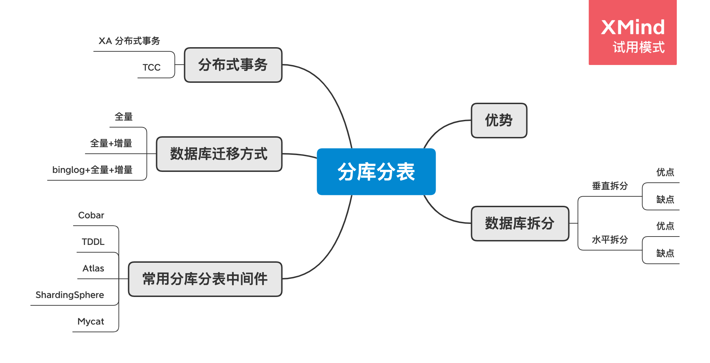

# 分库分表总结

## 脑图

## 分库分表的优势

| #            | 分库分表前                   | 分库分表后                                   |
| ------------ | ---------------------------- | -------------------------------------------- |
| 并发支撑情况 | MySQL 单机部署，扛不住高并发 | MySQL从单机到多机，能承受的并发增加了多倍    |
| 磁盘使用情况 | MySQL 单机磁盘容量几乎撑满   | 拆分为多个库，数据库服务器磁盘使用率大大降低 |
| SQL 执行性能 | 单表数据量太大，SQL 越跑越慢 | 单表数据量减少，SQL 执行效率明显提升         |

## 数据库拆分

### 垂直拆分

​	就是**把一个有很多字段的表给拆分成多个表**，**或者是多个库上去**。每个库表的结构都不一样，每个库表都包含部分字段。一般来说，会**将访问频率很高的字段放到一个表里去**，然后**将访问频率很低的字段放到另外一个表里去**。因为数据库是有缓存的，你访问频率高的行字段越少，就可以在缓存里缓存更多的行，性能就越好。

#### 优点

1. 单库（单表）变小，便于管理和维护
2. 对性能和容量有提升作用
3. 改造后，系统和数据复杂度降低
4. 可以作为微服务改造的基础

#### 缺点

1. 库变多，管理变复杂
2. 对业务系统有较强的侵入性
3. 改造过程复杂，容易出故障
4. 拆分到一定程度就无法继续拆分

### 水平拆分

​	就是把一个表的数据给弄到多个库的多个表里去，但是每个库的表结构都一样，只不过每个库表放的数据是不同的，所有库表的数据加起来就是全部数据。水平拆分的意义，就是将数据均匀放更多的库里，然后用多个库来扛更高的并发，还有就是用多个库的存储容量来进行扩容。

#### 优点

1. 解决容量问题
2. 比垂直拆分对系统影响小
3. 部分提升性能和稳定性

#### 缺点

1. 集群规模大，管理复杂
2. 复杂 SQL 支持问题（业务侵入性、性能）
3. 数据迁移问题
4. 一致性问题

## 常用的分库分表中间件

1. Cobar
2. TDDL
3. Atlas
4. ShardingSphere
5. Mycat

## 数据迁移方式

### 全量

1. 业务系统停机
2. 数据库迁移，校验一致性
3. 业务系统升级，接入新数据库

数据量大了话，停机时间过长

### 全量+增量

依赖于数据本身的时间戳

1. 先同步数据到最近的某个时间戳
2. 然后在进行升级时停机维护
3. 再同步最后一段时间的变化数据
4. 最后升级业务系统，接入新数据库

### binglog+全量+增量

通过主库或从库的 binlog 来解析和重新构造数据，实现复制，一般使用中间件来实现。

## 分布式事务

### XA 分布式事务

即：两阶段提交，有一个**事务管理器**的概念，负责协调多个数据库（资源管理器）的事务，事务管理器先问问各个数据库你准备好了吗？如果每个数据库都回复 ok，那么就正式提交事务，在各个数据库上执行操作；如果任何其中一个数据库回答不 ok，那么就回滚事务。

### TCC

TCC 的全称是：`Try`、`Confirm`、`Cancel`。

- Try 阶段：这个阶段说的是对各个服务的资源做检测以及对资源进行**锁定或者预留**。
- Confirm 阶段：这个阶段说的是在各个服务中**执行实际的操作**。
- Cancel 阶段：如果任何一个服务的业务方法执行出错，那么这里就需要**进行补偿**，就是执行已经执行成功的业务逻辑的回滚操作。（把那些执行成功的回滚）

