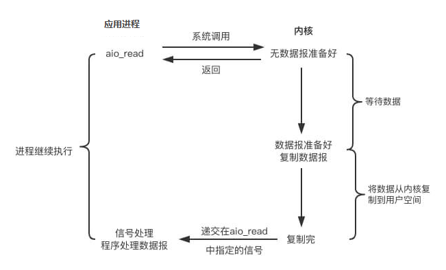

# Course 03

## JVM 核心技术调优分析与面试经验

### GC 日志分析与解读

#### 串行 GC（Serial GC 和 Serial Old GC）

##### 执行命令

```java
// java -Xmx512m -Xms512m -XX:+UseSerialGC -XX:+PrintGCDetails -XX:+PrintGCDateStamps GCLogAnalysis
// 也可以通过 -Xloggc:文件名称（例如 com.log.gc） 的模式将 gc 日志打印到文件中
```

##### 日志分析

一. 堆内存为 512m 时的情况


###### Young GC 日志分析

```java
// 日志内容：
2020-10-24T11:19:58.257-0800: [GC (Allocation Failure) 2020-10-24T11:19:58.257-0800: [DefNew: 157247K->17469K(157248K), 0.0252979 secs] 409440K->312208K(506816K), 0.0253343 secs] [Times: user=0.02 sys=0.01, real=0.03 secs]
```

1. **2020-10-24T10:45:41.527-0800 **表示 GC 事件开始的时间点，其中 **-800**表示的是当前是东八区

2. **GC (Allocation Failure)** 表示当前是 young gc，括号中的 **Allocation Failure** 表示的是当前执行 gc 失败的原因，本次 GC 事件，是由于对象分配失败，年轻代中没有空间来存放新生成的对象引起的。

3. **DefNew** 表示垃圾收集器的名称。这个名称表示：年轻代使用的单线程、标记-复制、STW 垃圾收集器。

   **156992K->156992K(157248K)** 跟在 DefNew 后面的这串表示的是垃圾收集之前和之后的年轻代大小，**(157248K)** 表示总年轻代大小。

4. **452519K->361312K(506816K)** 表示在垃圾收集之前和之后整个堆内存使用的情况。**(506816K)** 表示当前堆内存大小。

5. **0.0307947 secs** GC 事件持续的时间，以秒为单位

6. **[Times: user=0.02 sys=0.01, real=0.03 secs]** 表示此次 GC 的持续时间，**user** 表示所有 GC 线程消耗的 CPU 时间，**sys** 表示系统调用和系统等待事件消耗的时间，**real** 则表示应用程序暂停的时间。因为串行垃圾收集器是单线程，所以这里 real = user + system。

###### Full GC 日志分析

```java
// 日志内容：
2020-10-24T11:19:58.836-0800: [Full GC (Allocation Failure) 2020-10-24T11:19:58.836-0800: [Tenured: 349511K->349346K(349568K), 0.0445959 secs] 506714K->354775K(506816K), [Metaspace: 2720K->2720K(1056768K)], 0.0446419 secs] [Times: user=0.05 sys=0.00, real=0.05 secs]
```

1. **2020-10-24T11:19:58.836-0800** GC 开始时间

2. **Full GC (Allocation Failure)** 表示 Full GC，GC 原因是老年代中无法再存放更多的对象引起

3. **Tenured** 用于清理老年代空间的垃圾收集器名称。**Tenured** 表示使用的是单线程的 STW 的垃圾收集器，算法为 标记-清楚-整理。

   **349511K->349346K(349568K)** 表示垃圾收集前后老年代的堆内存使用情况，**(349568K)** 表示总的老年代的大小

4. **[Times: user=0.05 sys=0.00, real=0.05 secs]** 表示此次 GC 的持续时间与年轻代同理。可以看出 full gc 的时间比 young gc 的时间长，也就是说 **GC 的时间与存活的对象的总数量关系最大**。

二. 当将堆内存扩大到 2G 时


full gc 没有了，同时吞吐量也增大了，但是相对的 gc 的时间也变长了，因为堆中的对象总数大了。

#### 并行 GC（Parallel Scavenge + Parallel Old）

##### 执行命令

```java
java -Xmx512m -Xms512m -XX:+UseParallelGC -XX:+PrintGCDetails -XX:+PrintGCDateStamps GCLogAnalysis
java -Xmx2g -Xms2g -XX:+UseParallelGC -XX:+PrintGCDetails -XX:+PrintGCDateStamps GCLogAnalysis
```

##### 日志分析

一.堆内存为 512m 情况


###### Young GC 日志分析

```java
2020-10-24T11:35:15.332-0800: [GC (Allocation Failure) [PSYoungGen: 97899K->22844K(116736K)] 372660K->334863K(466432K), 0.0200301 secs] [Times: user=0.03 sys=0.15, real=0.02 secs]
```

1. **2020-10-24T11:35:15.332-0800** 当前 gc 开始时间
2. **GC (Allocation Failure)** 当前是 Young gc ，原因是年轻代无法存放新生成的对象
3. **PSYoungGen** 垃圾收集器名称，表示在年轻代中使用标记-复制算法的，STW 的并行垃圾收集器。**97899K->22844K(116736K)** 表示垃圾收集前后的年轻代使用情况。跟上面的串行 GC 一样。
4. **[Times: user=0.03 sys=0.15, real=0.02 secs]** **user** 表示当前 gc 线程所消耗的总 CPU 时间，**sys** 表示操作系统调用和系统等待事件所消耗的时间，**real** 表示实际应用程序暂停的时间。因为并不是所有的操作过程都能全部并行，所以在并行 GC 中，应用等待的时间约等于 user + sys / GC 线程数。默认情况下使用当前 CPU 的核心数。

可以发现并行 GC 的平均 gc 消耗时长比串行 gc 的时长要短。

###### Full GC 日志分析

```java
2020-10-24T11:35:15.874-0800: [Full GC (Ergonomics) [PSYoungGen: 104517K->0K(115712K)] [ParOldGen: 348977K->322893K(349696K)] 453494K->322893K(465408K), [Metaspace: 2720K->2720K(1056768K)], 0.0562529 secs] [Times: user=0.63 sys=0.02, real=0.06 secs]
```

1. **2020-10-24T11:35:15.874-0800** 当前 gc 开始时间

2. **Full GC (Ergonomics) ** 当前是 Full GC，当前 gc 原因是 jvm 自适应调解产生的一次 full gc

3. **[PSYoungGen: 104517K->0K(115712K)]** 与之前的介绍一样。可以发现年轻代使用量直接变为了 0 ，一般 full gc 中年轻代的结果都是这样。

4. **ParOldGen** 表示当前老年代的垃圾收集器的名称。这是一款采用标记-清楚-整理算法的 会STW 的并行垃圾收集器。

   **348977K->322893K(349696K)** 表示当前老年代垃圾收集前后的使用情况，以及当前老年代的大小。

5. **453494K->322893K(465408K)** 表示当前垃圾收集前后堆内存使用情况，以及当前堆内存大小。

6. **[Metaspace: 2720K->2720K(1056768K)]** 当前元空间使用情况

7. **0.0562529 secs** 表示此次 gc 事件持续的时间

8. **[Times: user=0.63 sys=0.02, real=0.06 secs]** 与年轻代表达的意思相同

二. 堆内存为 2g 情况


由此可见当堆内存提高后，gc 次数变少了，但是 gc 的时间也随之升高了，吞吐量也随之增大。

#### CMS GC（Parallel New 和 CMS）

##### 执行命令

````java
java -Xmx512m -Xms512m -XX:+UseConcMarkSweepGC -XX:+PrintGCDetails -XX:+PrintGCDateStamps GCLogAnalysis
java -Xmx2g -Xms2g -XX:+UseConcMarkSweepGC -XX:+PrintGCDetails -XX:+PrintGCDateStamps GCLogAnalysis
````

一. 堆内存为 256 m 情况

##### 日志分析


###### Young GC 日志分析

```java
2020-10-24T14:11:25.414-0800: [GC (Allocation Failure) 2020-10-24T14:11:25.414-0800: [ParNew: 139776K->17472K(157248K), 0.0224180 secs] 139776K->44991K(506816K), 0.0224601 secs] [Times: user=0.05 sys=0.15, real=0.02 secs]
```

与并行 gc 的 young gc 一致

###### Full GC 日志分析

```java
2020-10-24T14:11:25.599-0800: [CMS-concurrent-mark-start]
2020-10-24T14:11:25.601-0800: [CMS-concurrent-mark: 0.003/0.003 secs] [Times: user=0.01 sys=0.01, real=0.01 secs]
2020-10-24T14:11:25.601-0800: [CMS-concurrent-preclean-start]
2020-10-24T14:11:25.602-0800: [CMS-concurrent-preclean: 0.000/0.000 secs] [Times: user=0.00 sys=0.00, real=0.00 secs]
2020-10-24T14:11:25.602-0800: [CMS-concurrent-abortable-preclean-start]
2020-10-24T14:11:25.723-0800: [CMS-concurrent-abortable-preclean: 0.004/0.121 secs] [Times: user=0.92 sys=0.04, real=0.12 secs]
2020-10-24T14:11:25.723-0800: [GC (CMS Final Remark) [YG occupancy: 25308 K (157248 K)]2020-10-24T14:11:25.723-0800: [Rescan (parallel) , 0.0004298 secs]2020-10-24T14:11:25.723-0800: [weak refs processing, 0.0000304 secs]2020-10-24T14:11:25.723-0800: [class unloading, 0.0002234 secs]2020-10-24T14:11:25.724-0800: [scrub symbol table, 0.0002546 secs]2020-10-24T14:11:25.724-0800: [scrub string table, 0.0001349 secs][1 CMS-remark: 329788K(349568K)] 355097K(506816K), 0.0011603 secs] [Times: user=0.00 sys=0.00, real=0.00 secs]
2020-10-24T14:11:25.724-0800: [CMS-concurrent-sweep-start]
2020-10-24T14:11:25.725-0800: [CMS-concurrent-sweep: 0.001/0.001 secs] [Times: user=0.00 sys=0.00, real=0.00 secs]
2020-10-24T14:11:25.725-0800: [CMS-concurrent-reset-start]
2020-10-24T14:11:25.725-0800: [CMS-concurrent-reset: 0.001/0.001 secs] [Times: user=0.00 sys=0.00, real=0.00 secs]
```

包含了 CMS 的 6 个阶段，CMS 6 个阶段中只有在初始化标记和最终标记阶段才会触发 STW 事件，在有些情况下会出现 concurrent mode failure ，出现这个的时候 cms 会退化成单线程的 gc，会触发 STW 事件，此时 gc 时间较长。

二. 堆内存为 2g 情况


显然当堆内存设置为 2g 时，因为年轻代足够大，没有触发 full gc，与并行 gc 一样，因为堆内存增大，gc 的触发次数降低，当时每次回收的时间增长，吞吐量提高。

#### G1 GC

##### 执行命令

```java
java -Xmx512m -Xms512m -XX:+UseG1GC -XX:+PrintGC -XX:+PrintGCDateStamps GCLogAnalysis
java -Xmx2g -Xms2g -XX:+UseG1GC -XX:+PrintGC -XX:+PrintGCDateStamps GCLogAnalysis
```

##### 日志分析

一. 堆内存为 256m 情况


G1 GC 日志中各阶段已在图中标出，G1 GC 的日志包括了 young gc 、标记阶段和 mixed gc

二. 堆内存为 2g 情况


当堆内存为 2g 时，生成的对象数变多，并且只包含了两个阶段，一个是 young gc 一个是标记阶段，可以看到当堆内存为 2g 时，g1 的 young gc 的速度比其他并行 gc 和串行 gc 都短，并且生成的对象比其他 gc 多。

### JVM 线程堆栈数据分析

#### JVM 内部线程

1. VM 线程：单例的 VMThread 对象，负责执行 VM 操作，相当于主线程
2. 定时任务线程：单例的 WatcherThread 对象，模拟在 VM 中执行定时操作的计时器终端
3. GC 线程
4. 编译器线程：将字节码编译为本地机器代码
5. 信号分发线程：等待进程指示的信号，并将其分配给 Java 级别的信号处理方法

#### 安全点(safepoint)

​	Java STW 是通过安全点机制来实现的，当 JVM 收到 STW 请求，会等待所有线程到达安全点，才允许 STW 的线程独占进行工作。

​	对于解释执行来说，字节码与字节码之间皆可作为安全点，而对于及时编译器来说，因为是机器码，比较复杂，HotSpot JVM 虚拟机的做法是在生成代码的方法出口以及非计数循环的循环回边（back-edge）处插入安全点检测。

### 内存分析与相关工具

#### 对象头和对象引用

​		在 64 位 JVM 中，对象头占据的空间是 12 byte，但是以 8 字节对其，所以一个 Object 类实例至少占用 16 byte 。

​		在 32 位 JVM 中，对象头占 8 byte，以 4 的倍数对其。

​		通常在 32 位 JVM，以及内存小于 -Xmx 32G 的 64 位 JVM 上（默认开启指针压缩），一个引用占的内存默认是 4 个字节。

#### 几种 OutOfMemoryError 的情况

##### 一. OutOfMemoryError: Java heap space

创建新的对象时，堆内存中的空间不足以存放新创建的对象。

产生的原因：

1. 大部分原因是将一个大对象往一个小号的 java heap space 里面塞，解决办法就是扩大堆内存空间。
2. 超出预期的访问量/数据量：应用系统设计时，一般是有 "容量" 定义的，部署多少机器，用来处理多少的数据/业务。如果访问量突升，超过了预期的阈值，那么在峰值的那段时间，程序可能会出现卡死、并触发 java.lang.OutOfMemoryError: java heap space 错误。
3. 内存泄露，由于代码中的隐蔽错误，导致系统占用的内存越来越多，每执行一次就会占用更多的内存，最后耗光了堆中的内存，于是就会触发 java.lang.OutOfMemoryError: java heap space 错误。

##### 二. OutOfMemoryError: PermGen space/OutOfMemoryError: Metaspace

Jdk 8 以前是永久代，jdk 8 之后是元空间内存空间不足

产生原因：

​	加载到内存中的 class 数量太多或体积太大，超过了 PermGen / Metaspace 的大小。

解决办法：

​	增大 PermGen/Metaspace ，< jdk 8：-XX:MaxPermSize，>= jdk8：-XX:MaxMetaspaceSize。高版本 JVM 也可以：-XX:+CMSClassUnloadingEnabled

注：

​	jdk 8 以后，因为已经放到了 Metaspace，非堆中，所以基本元空间的大小跟实际内存相关，基本不会出现该情况。

##### 三. OutOfMemoryError：Unable to create new native thread

产生原因：

​	程序创建的线程数已达到上限值。

解决方法：

1. Linux 下，调整系统参数 unlimit -a （设置无限大）或 echo 1200000 > /proc/sys/kernel/threads-max (将上线设置的大一些)。
2. 降低 xss 等参数，默认情况下 xss 为 1m。
3. 调整代码，改变线程创建和使用方式，创建了太多线程对于有限的 CPU 而言，因为 java 创建的线程是 CPU 的线程数，所以对于 CPU 的核数有限的情况下，创建超出了 CPU 核数过多的线程了话，反而会因为线程的不断切换带来更多的性能上的开销。

#### 内存 dump 分析工具

1. Eclipse MAT
2. jhat

### JVM 问题分析调优经验

#### 高分配速率(High Allocation Rate)

##### 分配速率

​	单位时间内分配的内存量，通常用 MB/sec 作为单位。

​	计算方式为：上一次垃圾收集之后，与下一次 GC 开始之前的年轻代使用量，两者的差值除以时间。

###### 正常系统分配速率

​	分配速率与回收速率基本持平，并且速率都不高

###### 内存泄露时分配速率

​	分配速率大于回收速率，最后导致 OOM

##### 性能劣化时分配速率

​	分配速率与回收速率基本持平，但是速率很高，大部分时间都用在 gc 上了，导致 CPU 的大部分使用率也在 gc 上，从而造成实际工作线程的资源占用率低。

##### 优化手段

​	某些情况下，通过增加年轻代的大小，即可降低分配速率过高所造成的影响。增加年轻代的大小不会降低分配速率，但是会减少 GC 的频率。

#### 过早提升（Premature Promotion）

##### 提升速率

​	用于衡量单位时间内从年轻代提升到老年代的数据量，一般用  MB/sec 作为单位。

##### 产生情况

​	jvm 会将长时间存活的对象放入老年代，根据分代假设，可能存在一种情况，老年代中不仅有存活时间长的对象，也可能有存活时间短的对象，某些存活时间不长的对象被过早提升到了老年代。例如创建的大对象，如果年轻代放不下，就会直接放入老年代。

##### 优化手段

1. 增加年轻代大小，例如使用 -XX:NewSize ，间接降低 full gc 的次数。
2. 代码层面内减少每次批处理的数量，不要一次性拿取很大的一个对象。

# Course 04 - nio 与 netty

## 压测工具

### wrk 使用参数与结果说明

```
wrk -help
使用方法: wrk <选项> <被测HTTP服务的URL>                            
  Options:                                            
    -c, --connections <N>  跟服务器建立并保持的TCP连接数量  
    -d, --duration    <T>  压测时间           
    -t, --threads     <N>  使用多少个线程进行压测   
                                                      
    -s, --script      <S>  指定Lua脚本路径       
    -H, --header      <H>  为每一个HTTP请求添加HTTP头      
        --latency          在压测结束后，打印延迟统计信息   
        --timeout     <T>  超时时间     
    -v, --version          打印正在使用的wrk的详细版本信息
                                                      
  <N>代表数字参数，支持国际单位 (1k, 1M, 1G)
  <T>代表时间参数，支持时间单位 (2s, 2m, 2h)
```

```java
wrk -t16 -c40 -d30s --latency http://localhost:8801

// 结果说明
Running 30s test @ http://localhost:8801
  16 threads and 40 connections
    						(平均值)		(标准差)	 (最大值) (正负一个标准差所占比例)
  Thread Stats   Avg      Stdev     Max   +/- Stdev
    Latency(延迟)   245.80ms  175.26ms 795.46ms   64.85%
    Req/Sec     4.42      4.72    29.00     90.27%
  Latency Distribution（延迟分布）
     50%  206.95ms
     75%  384.36ms
     90%  464.51ms
     99%  752.55ms
  771 requests in 30.10s, 40.66KB read
  Socket errors: connect 0, read 773, write 0, timeout 0
Requests/sec:     25.62 (QPS 25.62,即平均每秒处理请求数为 25.62)
Transfer/sec:      1.35KB (平均每秒流量 1.35 KB)
```

## 服务器通信原理


## 单线程、多线程(直接创建)、线程池情况下 http 服务器压测情况分析

### 单线程情况下


​		由于单线程情况下，只有一个线程在处理 http 请求，是串行的，导致当有一个请求没有处理完成的时候，下一个请求一直被阻塞，所以压测下的 RPS  值很低。

### 多线程(直接创建线程)情况下


​		多线程情况下，RPS  值有了显著的提高，因为当前情况下每有一个请求，都会创建一个线程来处理当前请求，相比单线程情况，要好很多，但是每有一个请求就创建一个线程了话，因为 java 底层使用的是 CPU 的线程，首先创建线程的开销比较大，并且在压测的情况下，会创建较多的线程，CPU 每个核上都分配到了较多的线程，线程之前上下文的切换会产生性能上的开销。

### 线程池情况下

​		每有一个请求创建一个线程那样那么多的线程开销，同时线程变的可控，上下文切换少，所以整个压测下来的 RPS 值也高。

## NIO 模型与相关概念

### 同步与异步

​		同步与异步是通信模式，同步表示的是一个调用者发起调用后要一直等待着，等到消息返回之后才能继续下面的步骤，异步则是发起调用后就直接返回了，可以继续处理别的事情，被调用者通过状态、通知和回调来通知调用者。

### 阻塞和非阻塞

​		阻塞和非阻塞是线程处理模式，阻塞调用了话线程会一直挂起，等到返回了才能继续当前的线程，非阻塞则不会阻塞当前线程。

### Linux 5 种 IO 模型

注：本块内容参考自：https://www.jianshu.com/p/486b0965c296

#### 基础概念

##### 用户空间与内核空间

​		现在操作系统都是采用虚拟存储器，对于 32 位操作系统而言，它的寻址空间（虚拟内存空间）为 4G （2 的 32 次方）。操作系统的核心是内核，独立于普通的应用程序，可以访问受保护的内存空间，也有访问底层硬件设备的所有权限。为了保证用户进程不能直接操作内核（kernel），保证内核的安全，**操作系统将虚拟空间划分为两部分，一部分为内核空间，一部分为用户空间**。内核空间大小为 1G，从虚拟地址 0xC0000000 到 0xFFFFFFFF ，用户空间大小为 3G,从虚拟地址 0x00000000到0xBFFFFFFF 。

##### 进程切换

​		为了控制进程的执行，内核必须具有挂起正在 CPU 上运行的进程，并恢复以前起的某个进程的执行。这种行为被称为进程切换。进程之间的切换是很耗资源的.

##### 进程的阻塞

​		当某个正在执行的进程，正在等待某种操作的完成或者等待的一些事件未发生时，则由系统自动执行阻塞原语（Block），使当前执行的进程状态变为阻塞状态，**进入阻塞状态的进程不占用 CPU 资源**。

##### 文件描述符（fd）

​		文件描述符（fd）是计算机科学的一个术语，是一个用于表述指向文件的引用的抽象化概念。

​		文件描述符在形式上是一个非负整数。实际上，**它是一个索引值，指向内核为每一个进程所维护的该进程打开文件的记录表**。当程序打开一个现有文件或者创建一个新文件时，内核向进程返回一个文件描述符。在程序设计中，一些涉及底层的程序编写往往会围绕着文件描述符展开。但是文件描述符这一概念往往只适用于UNIX、Linux这样的操作系统。

##### 缓存 IO

​		缓存 IO 又被称作标准 IO，大多数文件系统的默认 IO 操作都是缓存 IO。在 Linux 系统的缓存 IO 机制中，操作系统会将 IO 的数据缓存在文件系统的页缓存（page cache）中，也就是说，**数据会先拷贝到操作系统内核的缓冲区中，然后才会从操作系统内核的缓冲区拷贝到应用程序的地址空间**。

###### 缺点

​		数据在传输过程中需要在应用程序地址空间和内核进行多次数据拷贝操作，这些数据拷贝操作所带来的 CPU 以及内存开销是非常大的。

#### IO 模型

##### 示例场景描述

​		周末和女友逛街，中午准备去吃饭，周末人多需要排队，我和女友有以下几种选择方案。

##### 同步阻塞 IO（BIO）

###### 场景描述

​	我和女友点完餐后，不知道什么时候能够做好，就只能一直坐在餐厅等着，直到做好，然后吃完再离开，中间没法出去逛街，只能在吃完之后再去逛街。

###### 定义

​		用户空间的应用程序执行一个系统调用，会导致应用程序堵塞，直到数据准备好，并且将数据从内核复制到用户进程，最后进程再处理数据，在等待数据到处理数据的两个阶段，整个线程都是堵塞的，不能处理别的网络 IO。调用应用程序处于一种不再消费 CPU 而只是简单等待响应的状态。

###### 流程图


###### 流程描述

​		当用户调用 recv()/recvfrom() 时，kernel 开始进入第一个阶段准备阶段（对于网络 IO 来说，很多时候数据一开始还没有到达，这个时候 kernel 就要等待足够的数据到来），这个过程需要等待，也就是说数据拷贝到操作系统内核的缓冲区中需要一个过程。而在用户进程这边，整个进程会被阻塞。**第二个阶段：当 kernel 中数据准备好了，它就会将数据从 kernel 中拷贝到内存**，然后 kernel 返回结果，用户进程接触 block 状态，重新运行起来。

###### 优点

能够及时返回数据

###### 缺点

用户需要等待一定时间

##### 同步非阻塞 IO

###### 场景描述

​		不甘心白白在这等，所以在这个期间，先去逛一会，回来询问服务员饭好了没有，来来回回好多次。

###### 定义

​		同步非阻塞就是通过轮询的方式，不断进行 recvfrom 系统调用，在每次进行 recvfrom 系统调用的时候，进程并没有被阻塞，内核会马上返回给进程，如果数据还没准备好，会返回一个 error，之后进程可以做其他的事情，然后再发起一次，直到内核数据准备好，再拷贝数据到进程，进行数据处理。需要注意的是，拷贝数据的整个过程，进程仍然是属于阻塞的状态。

###### 流程图


###### 流程描述

​		当用户发起 read 操作时，如果 kernel 没有准备好，会直接返回一个 error，并不会 block 用户进程，用户可以根据返回结果判断是否 error，如果数据还没有准备好，就可以再次发送 read 操作，一旦 kernel 准备好了，并且又再次收到了用户进程的 system call ，那么它马上就将数据拷贝到用户内存中，然后返回。

###### 优点

​		应用进程可以在等待的时间内做其他事

###### 缺点

​		任务完成的响应延迟大了，因为可能在两次轮询之间的任意时间完成，导致吞吐量降低。

##### IO 多路复用（IO multiplexing）

###### 场景描述

​		餐厅安装了一个电子屏幕来显示点餐的状态，这样不用去询问服务员了，每个人的餐是否好了直接看电子屏幕就可以了。

###### 定义

​		由于同步非阻塞方式需要不断主动轮询，轮询占据了很大一部分过程，会消耗大量的CPU时间，并且 “后台” 可能有多个任务在同时进行。

​		此时，人们就想到如果可以查询多个任务的完成状态，只要有任何一个任务完成，就去处理它。如果轮询不是进程的用户态，而是有人帮忙就好了。那么这就是所谓的 “IO 多路复用”。UNIX/Linux 下的 select、poll、epoll 就是干这个的（epoll 比 poll、select 效率高，做的事情是一样的）。

​		select 调用时内核级别的，相对非阻塞的轮询的区别在于，**select 调用可以等待多个 socket，能实现同时对多个 IO 端口进行监听，**当其中任何一个 socket 的数据准备好了，就能返回进行可读，然后进程再进行 recvform 系统调用，将数据由内核拷贝到用户进程，这个过程也是阻塞的。

​		select、poll、epoll 这几个函数可以阻塞多个 I/O 操作，而且可以同时对多个读操作，多个写操作的 I/O 函数进行监测，直到有数据可读或可写时，才真正调用 I/O 操作函数。

​		但是由于管理了多个 IO，所以多个 IO 之间的顺序变得不确定了。

###### 流程图


##### 信号驱动 IO

###### 场景描述

​		在逛街的途中，餐馆直接发送信息告诉我们有位置了，然后我们回到餐馆，坐下，然后吃饭。

###### 定义

​		信号驱动 IO 不会阻塞用户进程，用户进程需要等待数据的时候，会像内核发送一个信号，并且用户进程有一个信号处理函数，发送完信号之后，用户进程就可以做别的事情了。当内核将数据准备好之后，会发给进程一个信号，此时，用户进程可以通过调用信号处理函数，可以在信号处理函数中调用 recefrom ，去处理数据。

###### 流程图


##### 异步非阻塞IO

###### 场景描述

​		女友不想逛街也不想在餐厅等待，所以直接回家了，打了个电话给餐厅，叫了一个外卖，之后就可以做别的事情了，饭好了之后送货员直接将饭菜送到了家里来。

###### 定义

​		用户进程发出系统调用之后就直接返回，内核等待数据准备完成后，将数据拷贝到用户进程缓冲区，然后发送信号告诉告诉用户进程 IO 操作执行完毕，与信号驱动 IO 不同的是异步非阻塞 IO 前者是告诉用户进程数据准备完毕，后者直接告诉用户进程 IO 操作完毕。

###### 流程图



### Java NIO

更多内容可参考：https://javadoop.com/

#### 三大组件

##### Buffer

​		一个 Buffer 本质上是内存中的一块，可以将数据写入这块内存，之后再从这块内存中读取数据。

##### position、limit、capacity

​		Buffer 的操作方法和数组差不多，访问元素时也需要指定下标。

###### position

​		初始值是 0，每写入或读一个值时，自动加1，代表下一个要写入的位置

###### capacity

​		表示这个 Buffer 能存放的最大容量

###### limit

​		写操作模式下，limit 代表的是最大能写入的数据，这个时候 limit 等于 capacity。写结束后，切换到读模式，此时的 limit 等于 buffer 中实际的数据大小。

##### Channel

###### FileChannel

​		FileChannel 不支持非阻塞

###### SocketChannel

​		可以理解成一个 TCP 客户端

###### ServerSocketChannel

​		可以理解为一个服务端

###### DatagramChannel

​		一个类处理了服务端和客户端

##### Selector

​		多路复用在 java 中指的就是它，用于实现一个线程管理多个 Channel

## Netty

### netty 优势

​		基于 NIO 开发，可用于服务端、客户端，支持 http、websocket、rtsp、ssl等很多协议。服务器端具备高吞吐、低延迟、低开销、零拷贝、可扩容的特性。

### 基本概念

| 名称              | 解释                                                         |
| ----------------- | ------------------------------------------------------------ |
| Channel           | 通道，可执行读取/写入 IO 操作，Netty 对 Channel 的所有 IO 操作都是非阻塞的 |
| ChannelFuture     | 可以将回调方法传给 ChannelFuture，在操作完成时自动执行       |
| Event & Handler   | Netty 基于事件驱动，事件和处理器可以关联到入站和出站数据流   |
| Encoder & Decoder | 处理网络 IO 时，需要进行序列化和反序列化，转换 Java 对象与字节流 |
| ChannelPipeline   | 数据处理管道就是事件处理器链，有顺序、同一 Channel 的出站处理器和入站处理器在同一个列表中 |

