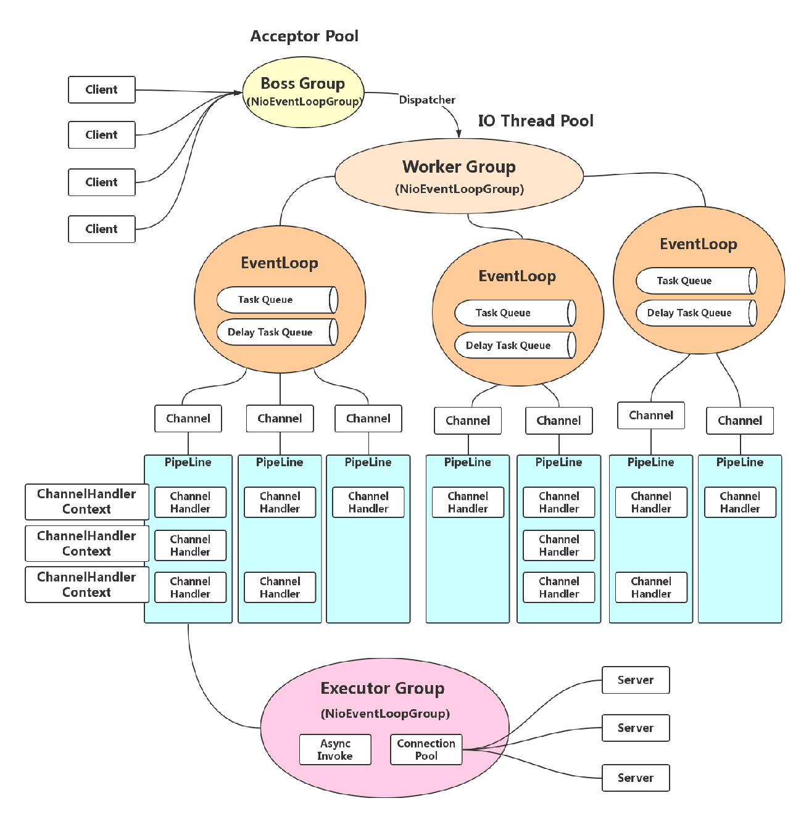
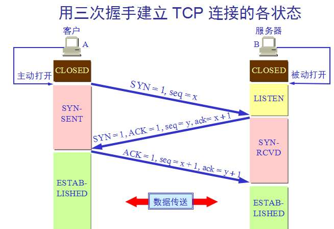
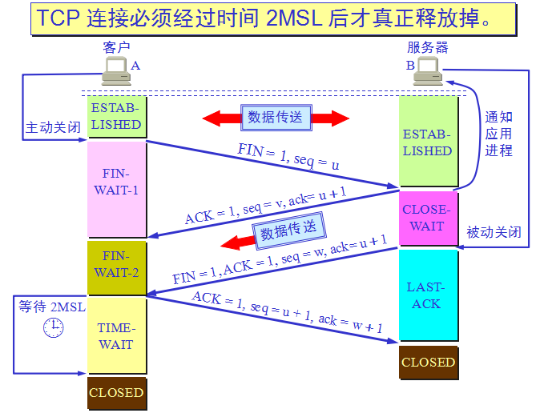
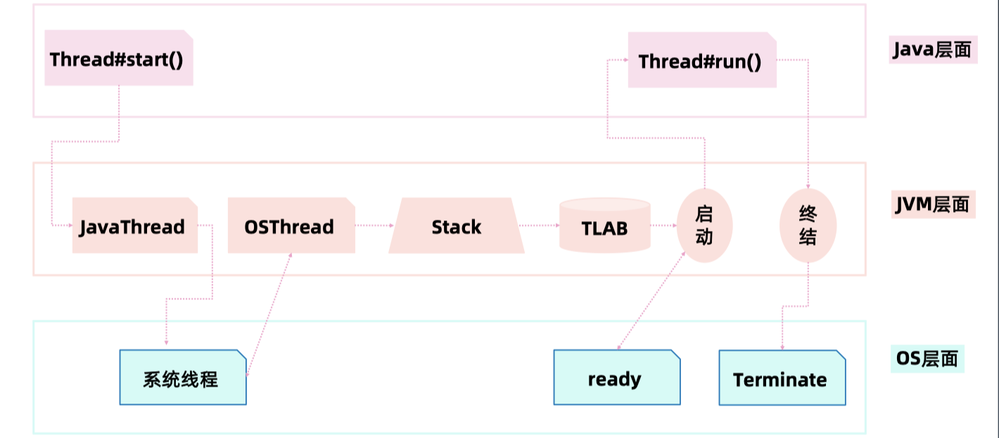
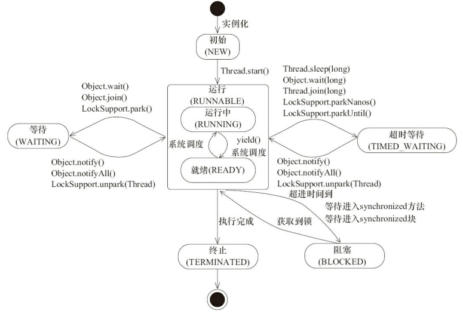

# Course 05 - netty

## 高性能

### 如何才算高性能

1. 支持的并发用户数（外部）

2. 高吞吐量（内因）

   ​	qps（queries per second ）: 每秒的查询率，对于一个查询的服务在规定时间内所处理的流量多少作为衡量指标。

   ​	tps（transaction per second）: 每秒的事务数，例如如果查询的服务变为下订单的一个服务，那就可以计算 tps。

3. 低延迟（内因）

   ​	响应时间（response time）：指从客户端发起请求到客户端收到请求的这段时间。

   ​	延迟（latency）: 指服务器端开始处理请求到处理结束的这段时间。

### 高性能的副作用

1. 系统的复杂度提升
2. 建设与维护成本增加
3. 因为故障或 bug 导致的破坏性也显著提升

## Netty 

### 运行原理

Client -> Boss Group -> Worker Group -> EventLoop -> Channel -> PipeLine 中的各种 ChannelHandler 进行处理 -> Executor Group

### 关键对象

1. Bootstrap: 启动线程，开启 sockt，包含 ServerBootstrap 和 Bootstrap，所有的东西都绑定在 Bootstrap 上。
2. EventLoopGroup：相当于线程池，里面包含多个 EventLoop
3. EventLoop：单线程轮询查看是否有事件要处理
4. SocketChannel
5. ChannelInitializer
6. ChannelPipeline：处理链
7. ChannelHandler：处理器

## Netty 网络程序优化

### 基础知识

#### MTU (maxitum transmission unit)

​		泛指通讯协议中的最大传输单元。在 TCP/IP 协议中，是 1500 byte，也就是说最大一次只能传输 1500 byte 的数据帧。

#### MSS（maxitum segment size）

​		指 TCP 建立连接后双方约定的可传输的最大 TCP 报文长度，如果顶层的 MTU 是 1500 byte，则 MSS = 1500 - 20（IP Header）-20（TCP Header） = 1460 byte。

### 粘包与拆包

​		粘包与拆包真正发生的原因都是人为的编码问题，比如在服务器端没有使用相关的一些解码器对传过来的数据包进行处理。

#### 粘包原因

​		如果发送的数据小于 TCP 发送缓冲区的大小，并且还未到达超时时间，TCP 会一次性将多次写入缓冲区的数据一次性发送出去，而服务端没有对这样的情况进行处理，就会产生粘包现象。

#### 拆包原因

​		如果发送的数据太大，就会被拆包成多个 TCP 报文分开传输，所以会出现拆包现象。

### Nagle 与 TCP_NODELAY

​		在实际中，我们调用 send 方法将数据进行传输的时候，并非直接发送到网络中，而是通过内核，在内核的发送缓冲区中存放，等到达到 Nagle 算法的触发条件才会再由网络将数据进行传输，而服务器端也是先通过内核的缓冲区接收到数据后，再传给应用层做相应的处理。

#### Nagle 算法优化触发条件

1. 缓冲区满时发送数据
2. 达到超时，默认 200ms

#### 优化手段

​		按需开启或关闭 TCP_NODELAY，比方说有些小的数据包，可能因为 Nagle 算法优化导致并没有马上就发送出去，如果关闭了 TCP_NODELAY ，这些小的数据包就不用等待，马上就能发送出去。所以在并发高的情况下，或者对延迟不明感的情况，Nagle 算法可以达到好的优化效果。

### 连接优化

#### TCP 三次握手

​		SYN 代表同步状态，ACK 代表确认，可以理解为 SYN 代表询问在不在，ACK 代表我在了，这样可以将 3 次握手理解为，首先客户端向服务器喊话，问服务器：你在不在？服务器接收到了，向客户端回话：我在了，你在不在？客户端向服务器回话：我在了。于是两边就建立起了连接，可以相互进行数据传送，

​		可以看到当客户端收到服务器端的回复之后，往服务端回话时，就已经将 socket 设置成了可传输的状态，而服务器端在最后收到客户端的回复之后，才设置成可传输的状态。

#### TCP 四次挥手

​		可以理解为，客户端跟服务器端说，我们分手吧，服务端收到消息了，然后回复收到了，然后服务端给客户端发送了消息说：好吧，分手吧。然后客户端向服务端发送消息说：好的，收到了。

​		当客户端多个线程发送请求的时候，每个线程都会占用一个端口，然后指定要发送的 Ip 和端口，通过 netstat 可以看到，有本地 Ip 和端口，还有远程的 IP 和端口，而服务端因为启动的服务只有一个端口，所以服务端在 linux 上占用的就是 FD (文件描述符)，而在 TCP 四次挥手的过程中，可以看到客户端有一个 2MSL 的TIME WAIT 的时间等待，一般默认情况下 linux 上是 2分钟1轮，也就是要花费 4 分钟，而 windows 上是1分钟1轮，也就是要花费 2 分钟。在这段时间内，客户端的端口还一直在占用中。

#### 优化手段

1. 减少等待时间。
2. 端口的复用。

### Netty 优化

1. 不要阻塞 EventLoop

   EventLoop 可以理解为一个单线程的操作，所以不要阻塞的意思就是少用 synchronize 之类的锁

2. 系统参数优化

   ulimit -a ：使单个进程可以使用的 fd 达到最大

   调整 timeout 时间：linux 上 /proc/sys/net/ipv4/tcp_fin_timeout，windows 上为注册表中的 TcpTimedWaitDelay

3. 缓冲区优化

   通过 netty 的编码层面调整

   SO_RCVBUF：设置接收端的缓冲区大小

   SO_SNDBUF：设置发送端的缓冲区大小

   SO_BACKLOG：服务端处理客户端连接请求是顺序处理的，所以同一时间只能处理一个客户端连接，多个客户端来的时候，服务端将不能处理的客户端连接请求放在队列中等待处理，backlog参数指定了队列的大小

   REUSEXXX：例如重用端口

4. 心跳周期优化

   心跳机制与断线重连

5. 内存与 ByteBuffer 优化

   减少用户态和内核态之间的数据拷贝，例如直接指定使用 DirectBuffer，这样用户态和内核态都用这一块内存，同时业务那一块可以使用 HeapBuffer （堆内存）。

6. 其他优化

   IoRatio：io 与非 io 之间的比例，默认是 50:50

   Watermark

   TrafficShaping

## API 网关

### 流量网关

关注稳定与安全

1. 全局性流控制
2. 日志统计
3. 防止 SQL 注入
4. 防止 Web 攻击
5. 屏蔽工具扫描
6. 黑白 IP 名单
7. 证书/加解密处理

### 业务网关

提供更好的服务

1. 服务级别流控
2. 服务降级与熔断
3. 路由与负载均衡、灰度策略
4. 服务过滤、聚合与发现
5. 权限验证与用户等级策略
6. 业务规则与参数校验
7. 多级缓存策略

# Course 06 - Java 并发编程

## Java 线程的创建过程

## Thread

### 守护线程

​	守护线程是指为其他线程服务的线程。在JVM中，所有非守护线程都执行完毕后，无论有没有守护线程，虚拟机都会自动退出。

​	通过 Thread#setDaemon(true) 方式启动。

### start() 和 run() 方法的区别

​	start() 方法创建新线程，run() 方法是本线程调用。

### 部分属性和方法

| 部分属性/方法                         | 说明                                                         |
| ------------------------------------- | ------------------------------------------------------------ |
| volatile String name;                 | 线程名称 - 诊断分析使用                                      |
| boolean daemon = false;               | 后台守护线程标识 - 决定 jvm 优雅关闭，默认不开启守护线程     |
| Runnable target;                      | 当前要运行的任务（只能通过构造函数传入）                     |
| synchronized void start()             | 【协作】启动新线程并自动执行                                 |
| void join()                           | 【协作】等待某个线程执行完毕                                 |
| static native Thread currentThread()  | 静态方法：获取当前线程信息                                   |
| static native void sleep(long millis) | 静态方法：线程睡眠并让出 CPU 时间片，但是 sleep 方法不释放当前线程的锁，并且不能被唤醒 |

### wait & notify

| Object#方法                        | 说明                                                         |
| ---------------------------------- | ------------------------------------------------------------ |
| void wait()                        | 释放当前锁之后，等待 0 ms ，再尝试获取锁                     |
| void wait(long timeout, int nanos) | 释放当前锁，等待到了时间自动唤醒或者中途被 notify() 或 notifyAll() 唤醒，nanos > 0 了话会将 timeout 参数 ++ |
| native void wait(long timeout)     | 释放当前锁，等待到了时间自动唤醒或者中途被 notify() 或 notifyAll() 唤醒，唤醒之后需要自动获取锁 |
| native void notify()               | 发送信号通知 1 个等待线程                                    |
| native void notifyAll()            | 通知所有 wait 的线程                                         |

### Thread 的状态改变操作

#### 等待但不释放锁

1. Thread.sleep(long millis)

   ​	静态方法。调用的时候是针对当前调用的线程，此时线程进入 TIMED_WAITING 状态，让出 CPU 时间片，但**不释放对象锁**， millis 时间后，线程自动苏醒进入就绪状态。

2. Thread.yield()

   ​	静态方法。调用的时候是针对当前调用的线程，该方法放弃获取的 CPU 时间片，但**不释放锁资源**，由运行状态变为就绪状态，让 OS 再次选择线程。

3. Thread#join() / Thread#join(long millis)

   ​	对象方法。当前线程中调用其他线程 t 的 join 方法，当前线程进入 WAITING/TIMED_WAITING 状态，**当前线程不会释放已经持有的锁资源**，待 t 线程执行完成或者 millis 时间到，当前线程进入就绪状态。

#### 等待但会释放锁

1. Object#wait()

   ​	对象方法。当前线程调用对象的 wait 方法后，**当前线程释放锁资源**，进入等待队列。依靠 notify() / notifyAll() 唤醒或者 wait(long timeout) 的 timeout 时间到了之后自动唤醒。

#### 唤醒方法

1. Object#notify()/ Object#notifyAll()

   ​	对象方法。唤醒在此对象监视器上等待的线程，notify 唤醒随机一个，notifyAll 唤醒所有等待线程，让其去争夺 CPU 资源。

### Thread 的终端与异常处理

1. 线程内部自己处理异常，不会溢出到外层。
2. 如果线程被 Object#wait、Thread#join 和 Thread#sleep 三种方法之一的任何一个方法调用导致阻塞，此时调用该线程的 interrupt() 方法，那么该线程会抛出一个 InterruptedException 中断异常（该线程必须事先预备好处理此异常），从而提早地终结被阻塞状态。如果线程当前没有被阻塞，这时调用 interrupt() 方法将不起作用，直到执行了 wait、sleep、join 的一种时，立马抛出 InterruptedException。相当于 interrupt() 方法给当前线程设置了一个标识，记录当前线程是 Interrupt 状态。
3. 如果是计算密集型的操作了话，分段处理，每个片检查一下状态，是否需要终止。

### Thread 的生命周期

#### 简化图

#### 详细图

#### 1. RUNNABLE 与 BLOCKED 的状态装换

​		只有一种情况能够触发这种转换，就是线程等待 synchronized 的隐式锁，synchronized 修饰的方法或代码块同一时刻只允许一个线程执行，其他线程就会从 RUNNABLE 转到 BLOCKED 状态，当等待的线程获取到 synchronized 隐式锁时，就又会从 BLOCKED 状态变为 RUNNABLE 状态。

#### 2. RUNNABLE 与 WAITING 的状态转换

三种场景

1. 获得 synchronized 隐式锁的线程，调用Object#wait() 会进入等待状态，可通过 Object#notify() 或 notifyAll() 方法唤醒。
2. Thread#join()，join() 对应的那个线程结束之后，当前调用的线程自动唤醒。
3. LockSupport#park()，通过 LockSupport#unpark(Thread thread) 方法唤醒。

#### 3. RUNNABLE 与 TIMED_WAITING 的状态转换

1. Thread.sleep(long millis)
2. 获得 synchronized 隐式锁的线程调用 Object#wait(long timeout) 方法
3. Thread.join(long millis)
4. LockSupport.parkNanos(Object blocker, long deadline)
5. LockSupport.parkUntil(long deadline)

### 线程安全

#### 原子性

​		一个或多个操作在 CPU 执行过程中不会被中断的特性称为原子性

#### 可见性

​		由于 CPU 的缓存会导致可见性问题。可以通过 volatile 关键字来保证可见性，它会保证修改的值会立即被更新到主存，当有其他线程需要读取时，它会去内存中读取新值，**但是 volatile 不能保证原子性**；另外，还可以通过 synchronized 和 Lock 也能保证可见性，保证同一时刻只有一个线程获取锁，并且在释放锁之前将会对变量的修改刷新到主存当中。

#### 有序性

​		java 编译器和处理器对指令进行的重排序可能会产生有序性问题。

##### happens-before 原则：

​		前面一个操作的结果对后续操作是可见的。

1. 程序次序规则

   一个线程内，按照代码先后顺序

2. 锁定规则

   一个 unLock 操作先行发生于对同一个锁的 lock 操作

3. volatitle 变量规则

   对一个变量的写操作先行发生于后面对这个变量的读操作

4. 传递规则

   如果操作 A 先行发生于操作 B，操作 B 先行发生于操作 C，则操作 A 先行发生于操作 C

5. 线程启动规则

   Thread 对象的 start() 方法先行发生于此线程的每一个动作

6. 线程中断规则

   对线程 interrupt() 方法的调用先行发生于被中断线程的代码检测到中断事件的发生

7. 线程终结规则

   线程中所有的操作都先行发生于线程的终止检测

8. 对象终结规则

   一个对象的初始化完成先行发生于它的 finalize() 方法的开始

#### volatile

1. 每次读取都强制从主内存刷数据
2. 适用场景：单个线程写；多个线程读
3. 原则：能不用就不用，不确定的时候也不用，因为 volatile 不能保证原子性
4. 替代方案：Atomic 原子操作类
5. volatile 能够防止指令重排序，volatile 上面的赋值对底其底下的操作可见

#### final

| final 定义类型    | 说明                                                         |
| ----------------- | ------------------------------------------------------------ |
| final class XXX   | 不允许继承                                                   |
| final 方法        | 不允许 Override                                              |
| final 局部变量    | 不允许修改                                                   |
| final 实例属性    | 1. 构造函数/初始化块/<init>之后不允许变更 2. 只能赋值一次 3.安全发布：构造函数结束返回时，final 预最新的值被保证对其他线程可见 |
| final static 属性 | 静态块执行后不允许变更；只能赋值一次                         |

final 申明的好处是告诉 jvm 和编译器我申明的这个是线程安全的。