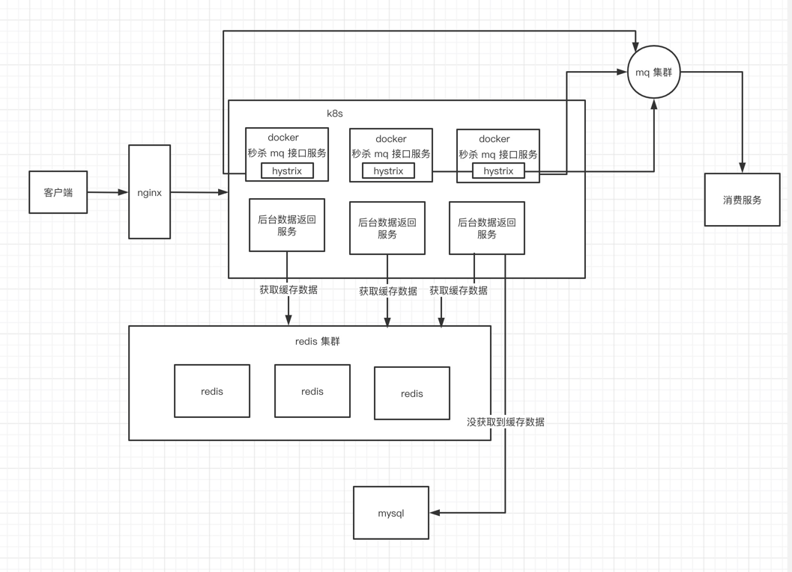

# 秒杀系统设计

1. nginx 负载均衡。
2. 使用 redis 集群将热点数据进行预热和缓存。
3. 对于一些当前不是很必要的服务就先下掉，暂时不提供服务
4. 部署多个秒杀的接口服务，将秒杀请求发往 mq 集群（例如 kafka）进行削峰，秒杀服务可以通过 k8s + docker 形式部署，在出现宕机的时候自动开启新的节点，接口服务使用 hystrix 做到熔断和降级。
5. 消费服务消费固定数量的请求做到秒杀的库存控制。

